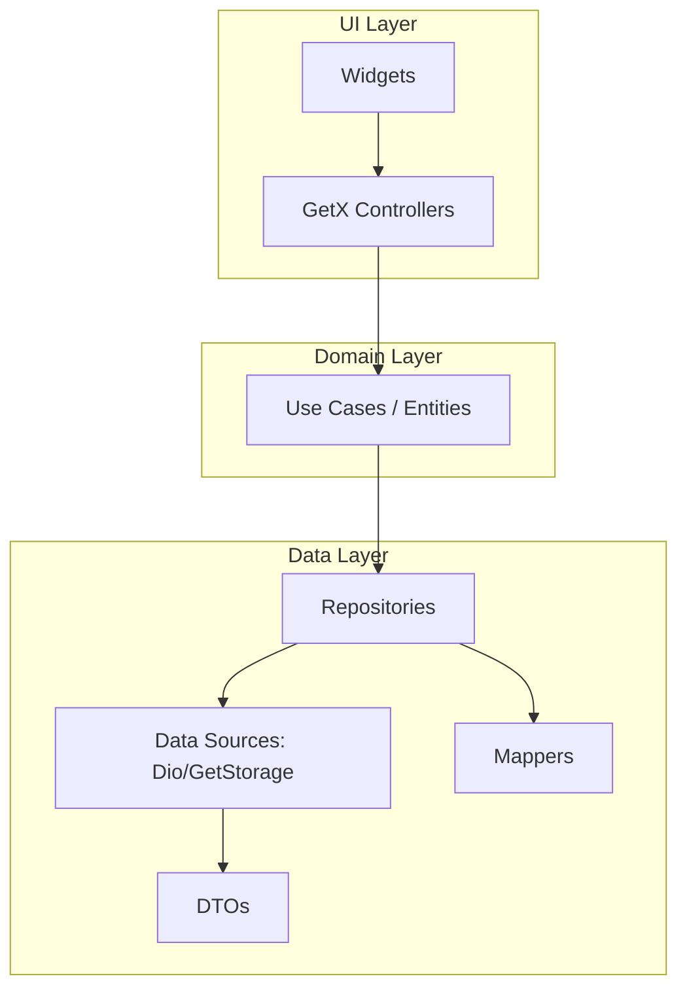

# Engineering Roadmap: Alpha Motors Architecture Evolution

This roadmap outlines the transition from a Service-heavy architecture to a clean, layered "Repository Pattern" architecture as recommended by the [Official Flutter Documentation](https://docs.flutter.dev/app-architecture/concepts).

## Phase 1: Data Layer Extraction (Completed)
*Objective: Isolate raw API interactions from business logic.*

- [x] **Create DTOs (Data Transfer Objects):** Created `PostDto` and `PostMapper`.
- [x] **Implement Mappers:** Created `PostMapper` to convert `PostDto` -> `Post` (Domain).
- [x] **Introduce Repositories:** 
    - Created `PostRepository` interface (Domain).
    - Created `PostRepositoryImpl` (Data).
    - Refactored `PostService` to use Repository.

## Phase 2: Domain Layer & Logic Decoupling (Completed)
*Objective: Make business logic testable without a simulator.*

- [x] **Filter Logic Refactor:** Implemented `PostFilter` entity.
- [x] **Validation Logic:** Created `PostValidator` class.
- [x] **State Objects:** Refactored `HomeController` to use `HomeStatus` enum (Initial, Loading, Success, Error, Empty).

## Phase 3: UI & State Management Hardening (Completed)
*Objective: Improve performance and maintainability.*

- [x] **Theme Normalization:** 
    - Updated `AppStyles` to provide theme-aware methods (e.g., `f14w4Th(context)`).
    - Migrated critical widgets (`otp_screen`, `post_details_screen`, etc.) to use theme-aware styles.
- [x] **Decouple GetX:** 
    - Refactored `PostedPostItem` to be a pure UI component, removing internal controller logic for resolution.
    - Updated `PostDetailsScreen` and other screens to rely on domain models.

## Phase 4: Quality Assurance (Completed)
*Objective: 100% confidence in every release.*

- [x] **Unit Tests:** 
    - Updated `post_controller_test.dart` to verify state logic with new DTOs.
    - Updated `home_controller_test.dart` to verify `HomeStatus` state transitions.
    - Verified all tests pass (`flutter test`).

---

## Architecture Visual Target

