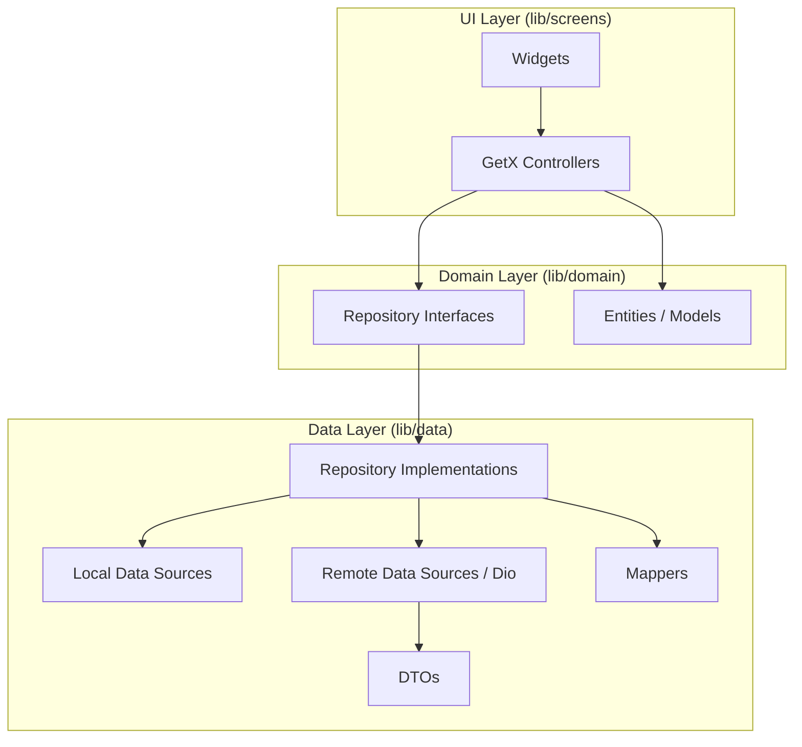

# Engineering Roadmap: Alpha Motors Architecture Evolution

This roadmap outlines the transition from a Service-heavy architecture to a clean, layered "Repository Pattern" architecture as recommended by the [Official Flutter Documentation](https://docs.flutter.dev/app-architecture/concepts).

## Phase 1: Data & Domain Hardening (Completed)
*Objective: Isolate raw API interactions and standardize business logic.*

- [x] **Consolidate DTOs:** Migrated all shared DTOs to `lib/data/dtos/`.
- [x] **Create Domain Entities:** Standardized `Brand`, `CarModel`, `Comment`, `Post`, `Banner`, `Subscription`, and `SearchSuggestion`.
- [x] **Implement Mappers:** Centralized mapping logic in `lib/data/mappers/` to isolate JSON parsing.
- [x] **Repository Interfaces:** Defined all data operations in `lib/domain/repositories/` returning strictly Domain Entities.

## Phase 2: Infrastructure & Data Source Abstraction (IN PROGRESS)
*Objective: Decouple Repositories from third-party storage and hardware libraries.*

- [x] **LocalStorage Wrapper:** Created `LocalStorage` abstraction to hide `GetStorage` implementation.
- [x] **Auth Cache Refactor:** Updated `AuthRepositoryImpl` to use `LocalStorage`.
- [x] **Brand History Refactor:** Updated `BrandRepositoryImpl` to use `LocalStorage`.
- [ ] **Task Persistence:** Refactor `UploadPersistenceService` to use `LocalStorage`.
- [ ] **Data Concern Relocation:** Move `PostDraft` and local persistence logic from UI folders to `lib/data/`.

## Phase 3: Service Consolidation & Decoupling (NEW)
*Objective: Remove redundant intermediate service layers.*

- [x] **Subscription Cleanup:** Removed `SubscriptionService`, moved logic to `SubscriptionRepositoryImpl`.
- [x] **Search Cleanup:** Removed `SearchService`, moved logic to `SearchRepositoryImpl`.
- [x] **Blog Cleanup:** Merged `BlogService` logic into `CommonRepositoryImpl`.
- [ ] **Post Consolidation:** Merge remaining `PostService` logic into `PostRepositoryImpl`.
- [ ] **Brand Model Consolidation:** Merge `BrandModelService` logic into `BrandRepositoryImpl`.

## Phase 4: UI Logic & Standards (NEW)
*Objective: Polish UI code and standardize cross-cutting concerns.*

- [ ] **Model Extensions:** Move date/currency formatting from Controllers/Widgets to Domain Model extensions (e.g., `blog.formattedDate`).
- [ ] **Error Handling:** Standardize error propagation using a unified `Failure` or `Result` class.
- [ ] **Strict Enforcement:** Update `test/architecture_test.dart` to strictly forbid UI-to-Data layer imports.

---

## Current Focus: Phase 2 & 3 (Immediate Cleanup)
1. **Refactor Upload Persistence:** Abstract storage from `UploadPersistenceService`.
2. **Consolidate Repositories:** Finalize merging `PostService` and `BrandModelService`.
3. **Move Data Concerns:** Ensure `PostDraft` is fully integrated into the Data layer.

---

## Architecture Visual Target

