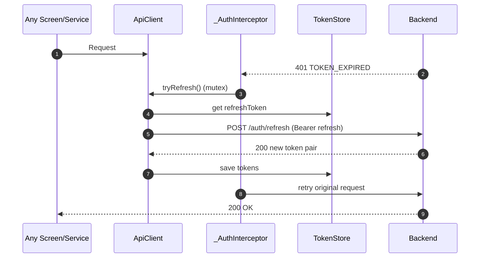

# API Reference (Flutter-facing) — Alpha Motors (auto.tm)

This document maps the Flutter app’s REST usage as implemented today.

- **Source of truth for endpoints in Flutter:** `lib/utils/key.dart` (`ApiKey`)
- **HTTP client:** `lib/services/network/api_client.dart` (`ApiClient` wrapping `Dio`)
- **Auth/session:** `lib/services/auth/auth_service.dart` + `TokenStore`

For the backend’s full contract, error codes, rate limits, and curl examples, see [backend/docs/API_REFERENCE.md](../../backend/docs/API_REFERENCE.md).

---

## Conventions

- **Base URL** is `API_BASE` from `.env`.
- Flutter builds `ApiKey.apiKey = "${API_BASE}api/v1/"`.
- Most app code should use **relative paths** via `ApiClient.dio` (baseUrl set to `ApiKey.apiKey`).

### Auth requirements

- **Public**: browsing/catalog endpoints.
- **Token required**: actions that create/modify user data, favorites, subscriptions, profile updates, token refresh/logout.

---

## Authentication & OTP

> Canonical OTP flow uses **POST with JSON body**.

| Endpoint | Method | Auth | Used by |
|----------|--------|------|---------|
| `/otp/send` | POST | Public | `AuthService.sendOtp()` |
| `/otp/verify` | POST | Public | `AuthService.verifyOtp()` |
| `/auth/me` | GET | Access | `AuthCheckPage`, profile refresh |
| `/auth/refresh` | POST | Refresh | `ApiClient.tryRefresh()` |
| `/auth/logout` | POST | Access | `AuthService.logout()` |
| `/auth/setFirebase` | PUT/POST* | Access | `NotificationService` (device token upload) |

\*The backend reference documents the exact method. Flutter constant name is `setFirebaseKey`.

### Token refresh behavior (interceptor)



---

## Posts

| Endpoint | Method | Auth | Purpose | Used by |
|----------|--------|------|---------|---------|
| `/posts` | GET | Public | List posts / search | `PostService`, Home/Search/Filter flows |
| `/posts` | POST | Access | Create a post listing | `PostService` + `UploadManager` |
| `/posts/me` | GET | Access | Get my posts | `PostService` |
| `/posts/list` | GET | Access | Favorites list (batch) | Favorites feature |

---

## Photos & Video

| Endpoint | Method | Auth | Purpose | Used by |
|----------|--------|------|---------|---------|
| `/photo/posts` | POST | Access | Upload post photos | `PostService` + `UploadManager` |
| `/video` | PUT | Access | Create video record | `UploadManager` / video flow |
| `/video/upload` | POST | Access | Upload video file | `UploadManager` / video flow |

### Video upload is two-step

```mermaid
flowchart LR
  A[User selects video] --> B[PUT /video\ncreate record]
  B --> C[videoId returned]
  C --> D[POST /video/upload\nmultipart file + postId (+ videoId)]
  D --> E[Video attached to post]
```

---

## Brands & Models

| Endpoint | Method | Auth | Purpose | Used by |
|----------|--------|------|---------|---------|
| `/brands` | GET | Public | Brand list | `BrandModelService` |
| `/brands/list` | GET | Public | Brand history/list variant | `BrandHistoryService` |
| `/models` | GET | Public | Model list | `BrandModelService` |
| `/brands/subscribe` | POST | Access | Subscribe to a brand | Profile / subscriptions |
| `/brands/unsubscribe` | POST | Access | Unsubscribe from a brand | Profile / subscriptions |

---

## Banners & Categories

| Endpoint | Method | Auth | Purpose | Used by |
|----------|--------|------|---------|---------|
| `/banners` | GET | Public | Home banners | Home screen |
| `/categories` | GET | Public | Categories + posts | Home screen |

---

## Comments

| Endpoint | Method | Auth | Purpose | Used by |
|----------|--------|------|---------|---------|
| `/comments` | GET | Public | List comments for post | Post details |
| `/comments` | POST | Access | Create comment | Post details |

---

## Subscriptions (Premium)

| Endpoint | Method | Auth | Purpose | Used by |
|----------|--------|------|---------|---------|
| `/subscription` | GET | Public | List subscription plans | Premium UI |
| `/subscription/order` | POST | Access | Place subscription order | Subscription flow |

---

## Blog / Vlog

| Endpoint | Method | Auth | Purpose | Used by |
|----------|--------|------|---------|---------|
| `/vlog` | GET | Public | List blog posts | Blog screen |
| `/vlog` | POST | Access* | Create blog post | Blog create flow |
| `/vlog/{uuid}` | GET | Public | Blog details | Blog details |
| `/photo/vlog` | POST | Access* | Upload blog image | Blog create flow |

\*Auth requirement depends on backend rules. Flutter code uses token-enabled `ApiClient`.

---

## Profile Media

| Endpoint | Method | Auth | Purpose | Used by |
|----------|--------|------|---------|---------|
| `/photo/user` | POST/PUT* | Access | Upload user avatar/photo | Profile |
| `/auth` | PUT* | Access | Update user profile details | Profile |

\*See backend reference for exact method(s).

---

## Legacy (Deprecated in Flutter)

These constants exist in `ApiKey` but should not be used for new code:

| Constant | Endpoint | Notes |
|----------|----------|------|
| `registerKey` | `/auth/register` | legacy auth flow |
| `loginKey` | `/auth/login` | legacy auth flow |

A legacy service exists at `lib/services/auth_service.dart` that uses GET query params for OTP. The canonical implementation is `lib/services/auth/auth_service.dart`.

---

## Quick Trace: Feature → Service → Endpoint

| Feature | Service | Endpoint(s) |
|---------|---------|-------------|
| OTP login | `AuthService` | `/otp/send`, `/otp/verify` |
| Session validation | `ApiClient` + UI gate | `/auth/me` |
| Refresh token | `ApiClient` | `/auth/refresh` |
| Post creation | `PostService` + `UploadManager` | `/posts`, `/photo/posts`, `/video`, `/video/upload` |
| Brands/models | `BrandModelService` | `/brands`, `/models` |
| Home | home controllers | `/banners`, `/categories`, `/posts` |
| Blog | `BlogService` | `/vlog`, `/photo/vlog` |
| Premium | `SubscriptionService` | `/subscription`, `/subscription/order` |
