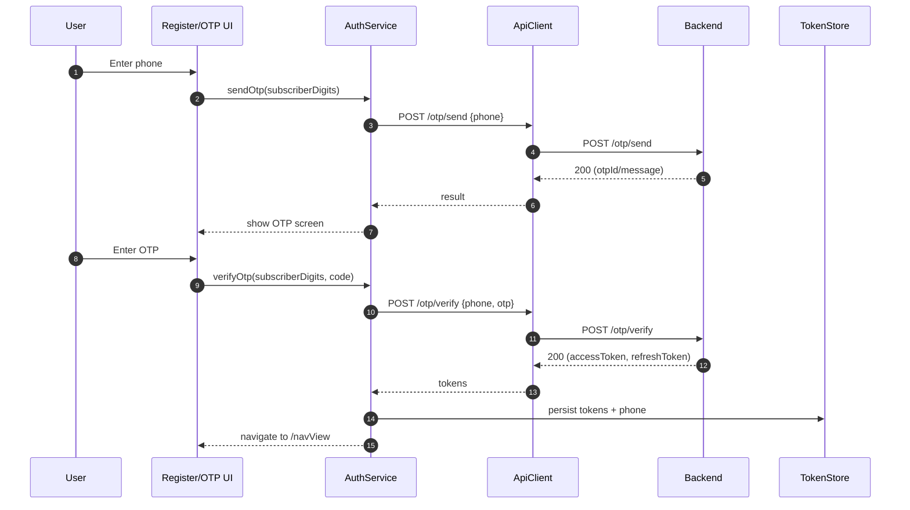
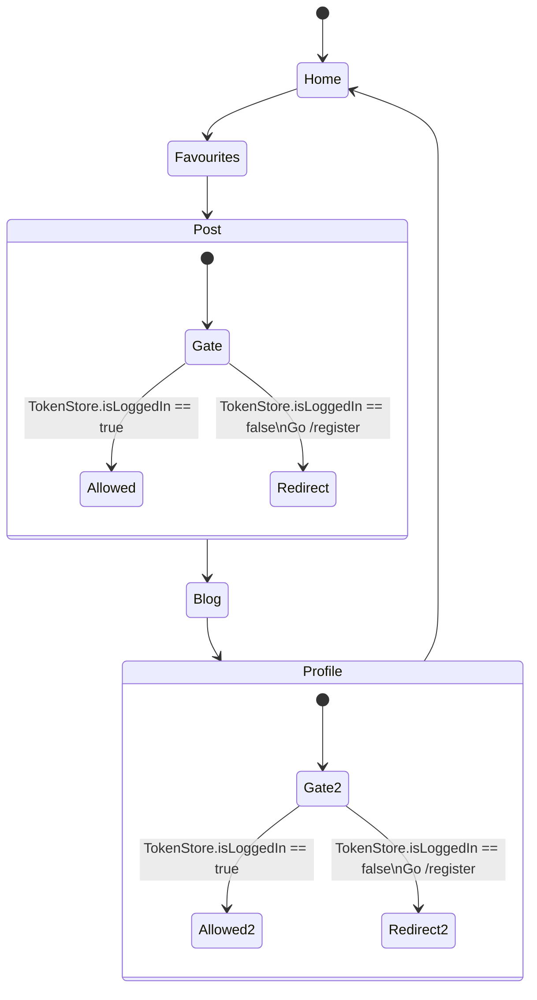
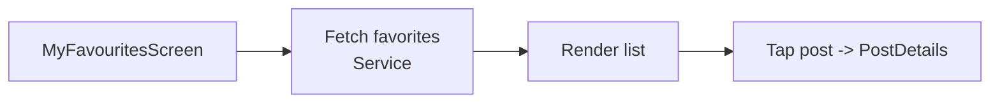
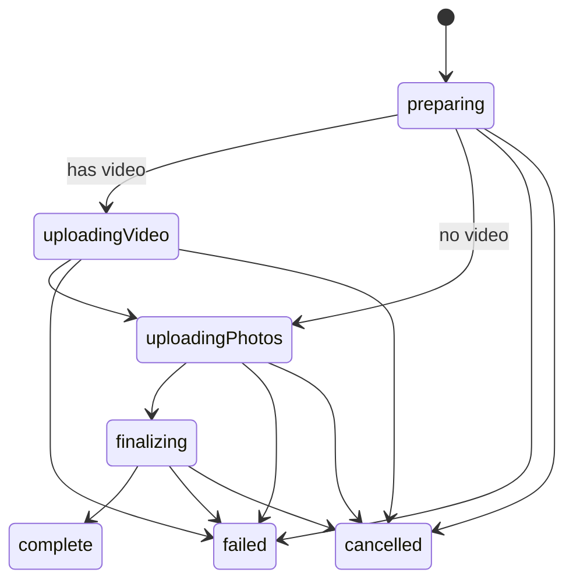
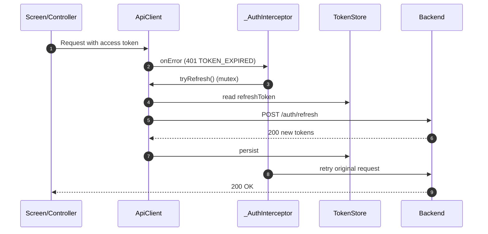

# App Flow — Alpha Motors (auto.tm) Flutter App

This document maps the main user journeys end-to-end based on the current Flutter code in `lib/`.

---

## Routes & Shell

### Named routes

| Route | Page | Notes |
|------:|------|-------|
| `/` | `AuthCheckPage` | Session validation gate (not the initial route) |
| `/splash` | `CustomSplashScreen` | Splash UI |
| `/register` | `SRegisterPage` | Phone entry / start auth |
| `/checkOtp` | `OtpScreen` | OTP verification |
| `/navView` | `BottomNavView` | Main app shell (5 tabs) |
| `/home` | `HomeScreen` | Direct entry to Home |
| `/profile` | `ProfileScreen` | Direct entry to Profile |
| `/filter` | `FilterScreen` | Filter UI |
| `/search` | `SearchScreen` | Search UI |

### Bottom navigation tabs

| Tab index | Label | Page | Auth gated? |
|----------:|-------|------|-------------|
| 0 | home | `HomeScreen` | No |
| 1 | fav | `MyFavouritesScreen` | No |
| 2 | post | `PostCheckPage` | **Yes** |
| 3 | blog | `BlogScreen` | No |
| 4 | profile | `ProfileCheckPage` | **Yes** |

Auth-gating is implemented in `BottomNavController.changeIndex()` by checking `TokenStore.to.isLoggedIn`.

---

## Startup Flow

Important nuance: the app bootstraps services and then starts at **`/navView`**.

```mermaid
flowchart TD
  A[main()] --> B[GetStorage.init]
  A --> C[Firebase.initializeApp]
  A --> D[dotenv.load(.env)]
  A --> E[initServices()\nregister GetX services/controllers]
  E --> F[Permissions requested\n(camera/photos/storage/notifications)]
  F --> G[Cache auto-prune\nAppCacheCleaner.autoPruneIfNeeded]
  G --> H[runApp(AlphaMotorsApp)]
  H --> I[GetMaterialApp\ninitialRoute = /navView]
  I --> J[BottomNavView]
```

---

## Session Gate (AuthCheckPage at `/`)

`AuthCheckPage` is the canonical session validation logic. It is routed at `/` but is **not** the default initial route.

```mermaid
flowchart TD
  A[AuthCheckPage] --> B{TokenStore.hasTokens?}
  B -- No --> R[/register]
  B -- Yes --> C[GET /auth/me\n(ApiClient with interceptor)]
  C --> D{Success?}
  D -- Yes --> N[/navView]
  D -- No --> E[Clear tokens\nTokenStore.clear]
  E --> R
```

---

## Authentication Journey (OTP)

The canonical auth flow uses JSON POST bodies:
- `POST /otp/send` with `{ phone }`
- `POST /otp/verify` with `{ phone, otp }`



---

## Bottom Navigation: Auth-gated Tabs



---

## Browsing & Discovery (Home)

Home is available without authentication.

Typical data sources:
- Banners
- Categories
- Premium/subscriptions
- Post lists

(Implementation details are in the relevant controllers under `lib/screens/home_screen/controller/`.)

---

## Filtering & Search

- Filter UI is `FilterScreen` with `FilterController` (registered as `permanent: true`)
- Search UI is `SearchScreen`

```mermaid
flowchart LR
  A[Home/Search] --> B[Open FilterScreen]
  B --> C[FilterController builds query]
  C --> D[Service fetches posts\n(PostService)]
  D --> E[UI renders result list]
```

---

## Favorites

Favorites are shown in `MyFavouritesScreen` and rely on the backend favorites list endpoint.



---

## Posting a Car (Draft + Upload Manager)

Posting is a multi-step flow with resilience:
- Drafts persist locally (`DraftService`) so user progress survives restarts.
- Upload is orchestrated via `UploadManager` with explicit phases and retry-friendly snapshots.

### Upload phases



### Post creation flow

```mermaid
flowchart TD
  A[Post tab] --> B{Logged in?}
  B -- No --> R[/register]
  B -- Yes --> C[Post form\nPostController]

  C --> D[Save draft\nDraftService]
  C --> E[User presses Post]

  E --> F[Create PostUploadSnapshot\n(photo base64 lengths, IDs, fields)]
  F --> G[UploadManager starts]
  G --> H[Upload video (optional)]
  H --> I[Upload photos]
  I --> J[Finalize post]
  J --> K[Success -> Posted posts screen]

  G --> X[Failure -> UI shows retry]
```

---

## Token Refresh (401 handling)

Token refresh happens transparently via `ApiClient` interceptor.



---

## Notifications

Notifications use:
- `firebase_messaging` for remote push
- `flutter_local_notifications` for local display

Initialization is handled by `NotificationService.init()` during `initServices()`.

---

## Source Pointers

- Bootstrap: `lib/main.dart`
- Auth gate: `lib/app.dart`
- Navbar: `lib/navbar/navbar.dart`, `lib/navbar/controller/navbar_controller.dart`
- Upload orchestration: `lib/screens/post_screen/controller/upload_manager.dart`
- Token refresh: `lib/services/network/api_client.dart`
