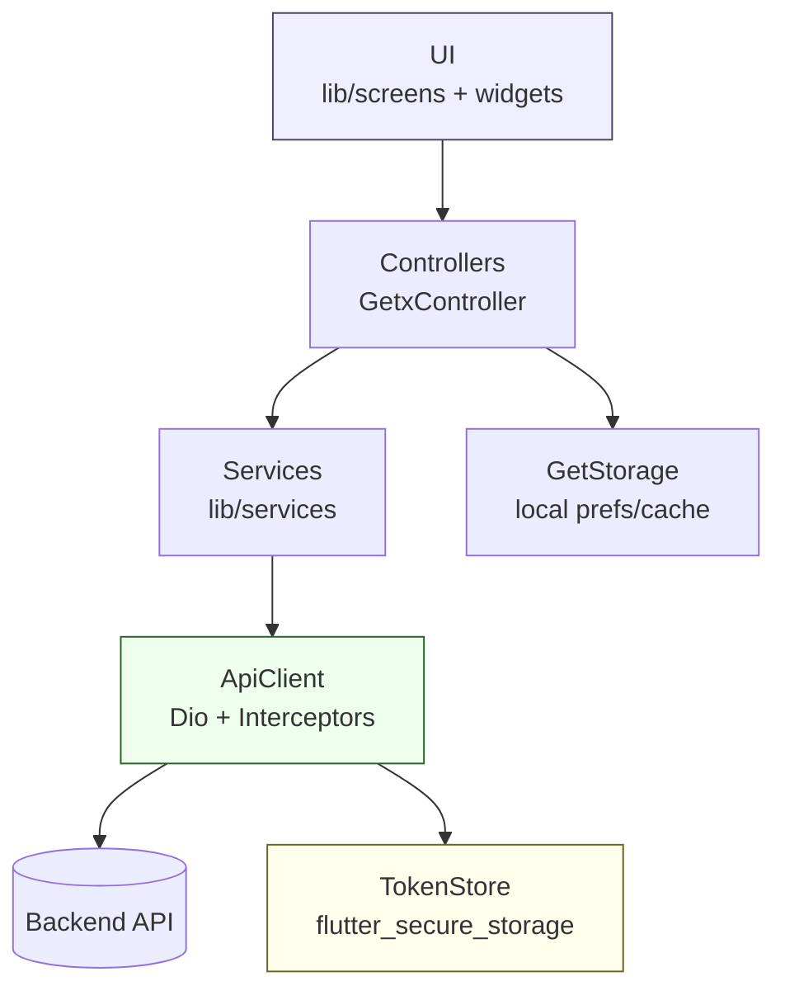
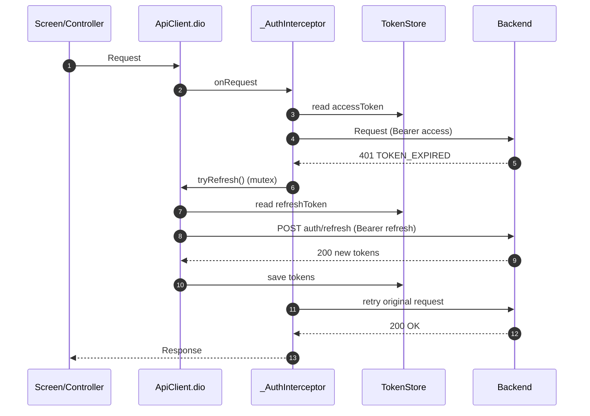

# Architecture — Alpha Motors (auto.tm) Flutter App

> This document describes the *actual* architecture implemented in `lib/` today: GetX-based state management, a centralized `Dio` client (`ApiClient`) with auto-refresh, secure token storage (`TokenStore`), and feature screens organized by module.

---

## Goals

- Keep **UI (screens/widgets)** free from networking concerns.
- Centralize HTTP, auth, retries, and token refresh in one place (`ApiClient`).
- Use GetX for **dependency injection**, **reactive state**, and **routing**.
- Persist critical user state (tokens, language, theme, drafts) safely.

---

## System Context

```mermaid
flowchart LR
  User((User)) --> App[Flutter App\nGetX + Dio]

  App -->|REST| API[NestJS API\n/api/v1 on :3080]
  API --> DB[(PostgreSQL :5432)]

  API <-->|Socket.IO| ClientWS[Client WS :3090\n(chat/notifications)]
  API <-->|Socket.IO| SmsGW[SMS Gateway :3091\nphysical Android device]

  App -->|FCM| FCM[Firebase Cloud Messaging]
  App -->|Local Notifs| Local[flutter_local_notifications]
```

Backend details are in [backend/docs/ARCHITECTURE.md](../../backend/docs/ARCHITECTURE.md).

---

## Repository Structure (Flutter)

Top-level layout inside `lib/`:

- `main.dart`: app entry point + `initServices()`
- `app.dart`: `/` route auth gate (`AuthCheckPage`)
- `screens/`: UI features (screen + controller + widgets)
- `services/`: HTTP-facing services (Auth, Post, Blog, Brands, Subscriptions, Notifications)
- `services/network/api_client.dart`: `Dio` singleton + auth interceptor
- `services/token_service/token_store.dart`: secure token persistence
- `global_controllers/`: theme/language/currency/connectivity/download
- `global_widgets/`: reusable global widgets (offline screen, refresh)
- `ui_components/`: `AppColors`, `AppStyles`, `AppImages` constants
- `utils/`: keys/endpoints, themes, i18n translations, cache cleaner, logging

---

## Layered Architecture (as enforced by tests)

The architecture test `test/architecture_test.dart` enforces:
- `lib/screens/**` must not directly call the `http` package.
- `lib/screens/**` must not instantiate raw `Dio()` (must go through `ApiClient`).



---

## App Bootstrap & Dependency Injection

`main.dart` initializes platform services and registers GetX singletons.

Key ordering constraints:
- `TokenStore.init()` must complete before `ApiClient.init()` (so interceptor can read tokens).
- `ApiClient.init()` must happen before services that depend on it.

```mermaid
flowchart TD
  A[main()] --> B[GetStorage.init]
  A --> C[Firebase.initializeApp]
  A --> D[dotenv.load(.env)]
  A --> E[initServices()]

  E --> E1[ThemeController\nGet.put]
  E --> E2[ConnectionController\nGet.put]
  E --> E3[DownloadController\nGet.put]
  E --> E4[UploadManager.init\nGet.putAsync]

  E --> E5[PostController\nGet.lazyPut(fenix:true)]

  E --> E6[TokenStore.init\nGet.put(permanent:true)]
  E6 --> E7[ApiClient.init\nGet.putAsync]
  E7 --> E8[AuthService\nGet.put]

  E7 --> E9[Domain services\nGet.put]
  E9 --> E10[NotificationService.init\nGet.putAsync]

  E --> E11[ProfileController\npermanent]
  E --> E12[FilterController\npermanent]
  E --> E13[HomeController\npermanent]

  A --> F[runApp(AlphaMotorsApp)]
```

### Lifecycle conventions

- **Global controllers**: typically `Get.put(...)`, sometimes `permanent: true`.
- **Domain services**: `GetxService` singletons.
- **On-demand controllers**: `Get.lazyPut(fenix: true)` for recreation.

---

## Networking & Auth: `ApiClient` + Interceptor

### Responsibilities

`ApiClient` (`lib/services/network/api_client.dart`) provides:
- `dio` configured with `baseUrl = ApiKey.apiKey` and timeouts
- `_AuthInterceptor` that:
  - Adds `Authorization: Bearer <accessToken>` to requests
  - On 401 `TOKEN_EXPIRED`: refreshes tokens (mutex), retries the original request
  - On 401 `USER_DELETED`: forces logout
  - On 404 for `/auth/me`: forces logout



### Token storage

`TokenStore` uses `flutter_secure_storage` for:
- `accessToken`
- `refreshToken`
- `phone`

Other preferences and caches are stored in `GetStorage` (language, currency, brand/model cache, drafts).

---

## Authentication Service

The canonical auth service is:
- `lib/services/auth/auth_service.dart`

It provides:
- `sendOtp()` → `POST /otp/send`
- `verifyOtp()` → `POST /otp/verify`
- `refreshTokens()` → delegates to `ApiClient.tryRefresh()`
- `logout()` → `POST /auth/logout` + clears `TokenStore` + notifies controllers

> There is also a legacy `lib/services/auth_service.dart` using old GET query OTP endpoints. It is not registered in `initServices()` and should be treated as deprecated/dead.

---

## Navigation & Shell

Main shell is `BottomNavView` with an `IndexedStack` and 5 tabs:

- Home
- Favourites
- Post (**auth required**)
- Blog
- Profile (**auth required**)

Auth-gating is enforced in `BottomNavController.changeIndex()` using `TokenStore.to.isLoggedIn`.

---

## Data Models

Models live in two places:

- Shared DTOs: `lib/models/post_dtos.dart`
  - `BrandDto`, `ModelDto`, `PostDto`, `Failure`
- Feature models: `lib/screens/**/model/*.dart`
  - e.g. detailed `Post` for the post-details screen

This separation reflects different JSON shapes returned by the API (list DTO vs. detail model).

---

## Cross-cutting Concerns

### Internationalization (i18n)

- `lib/utils/translation.dart` defines `AppTranslations` (EN/TM/RU).
- Screens use `.tr` keys.

### Themes

- `lib/utils/themes.dart`: `AppThemes.light/dark`
- `ThemeController` persists dark-mode preference in `GetStorage`.

### Cache management

- `lib/utils/cache_cleaner.dart`: `AppCacheCleaner` analyzes and prunes caches.
- Brand/model caching: `BrandModelService` uses a TTL strategy (GetStorage).

---

## Source Pointers

- Entry point: `lib/main.dart`
- Auth gate: `lib/app.dart` (`AuthCheckPage`)
- Routes/shell: `lib/navbar/navbar.dart`
- Networking: `lib/services/network/api_client.dart`
- Tokens: `lib/services/token_service/token_store.dart`
- Endpoints: `lib/utils/key.dart`
- Architecture enforcement: `test/architecture_test.dart`
