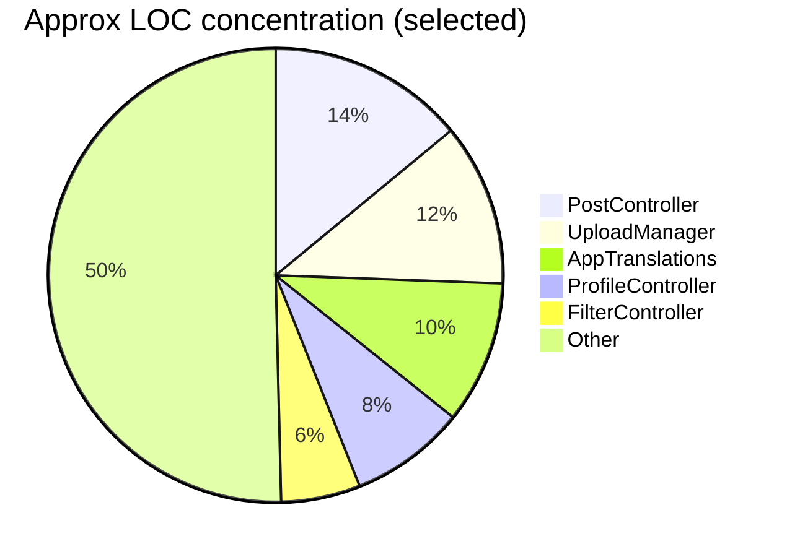

# Empirical Evaluation — Alpha Motors (auto.tm) Flutter Codebase

This document evaluates the Flutter codebase as it exists today: architecture adherence, maintainability, complexity hotspots, and test coverage.

---

## Snapshot (February 2026)

### Tech + architecture signals

- **State management:** GetX (`GetxController`, `Rx<T>`, `Obx()`)
- **Networking:** `Dio` via centralized `ApiClient` with auth interceptor
- **Token storage:** `flutter_secure_storage` via `TokenStore`
- **Local prefs/cache:** `GetStorage`
- **Media:** image/video selection + compression + background upload orchestration
- **Notifications:** FCM + local notifications
- **i18n:** 3 locales (EN/TM/RU)

---

## Quantitative Indicators (lightweight)

These are intentionally “low tooling” metrics derived from reading the code.

### Large-file hotspots (maintainability risk)

| File | Approx size | Notes |
|------|-------------|------|
| `lib/screens/post_screen/controller/post_controller.dart` | ~1390 LOC | Very broad responsibilities (form state, validation, side effects) |
| `lib/screens/post_screen/controller/upload_manager.dart` | ~1148 LOC | Complex upload pipeline, persistence, retry, media handling |
| `lib/utils/translation.dart` | ~1010 LOC | Expected (translations), but hard to review/merge |
| `lib/screens/profile_screen/controller/profile_controller.dart` | ~816 LOC | Profile data + UI state + service orchestration |
| `lib/screens/filter_screen/controller/filter_controller.dart` | ~560 LOC | Filtering logic and query building |

### Test structure (what exists)

- Architecture rules: `test/architecture_test.dart`
  - Enforces **no direct HTTP** in `lib/screens/**`
  - Enforces at least **3** `*_service.dart` files in `lib/services/`

---

## Architecture Adherence

### What is enforced (automated)

`test/architecture_test.dart` enforces two key constraints:

1. **UI layer must not make direct HTTP calls**
   - No `package:http/http.dart` usage + `http.get/post/...` inside `lib/screens/**`.
   - No `Dio()` instantiation inside `lib/screens/**` unless it references `ApiClient`.
2. **Service layer must exist**
   - At least 3 `*_service.dart` files.

```mermaid
flowchart LR
  UI[lib/screens] -. must not .-> HTTP[http.get / raw Dio()]
  UI --> C[Controllers]
  C --> S[Services]
  S --> AC[ApiClient (Dio)]
  AC --> API[(Backend)]

  style UI fill:#eef,stroke:#446
  style AC fill:#efe,stroke:#262
```

### What is implemented (observed)

- Most networking is routed through `ApiClient` and feature services.
- Token refresh uses a **mutex** (`Completer`) to avoid concurrent refresh storms.

---

## Strengths

- **Clear separation of concerns** between UI/controllers and services (and a test to enforce it).
- **Centralized auth handling** in `ApiClient` interceptor (refresh + retry).
- **Secure token storage** via `TokenStore` using platform secure storage.
- **Resilient posting flow** with draft persistence and an explicit upload phase machine.
- **Background/async-friendly parsing** in places (e.g., isolate-based parsing for some services).
- **Internationalization coverage** is broad (EN/TM/RU) and consistently used via `.tr`.
- **Cache management** exists (auto-prune + TTL caching for some datasets).

---

## Issues / Risks (prioritized)

### High

- **God controllers / large files**: multiple controllers exceed 500+ LOC. This increases defect risk, makes testing harder, and slows feature velocity.

### Medium

- **Duplicate auth implementations**:
  - Canonical: `lib/services/auth/auth_service.dart` (POST body)
  - Legacy: `lib/services/auth_service.dart` (GET query params)
  - The legacy version is dead code but still present, which increases confusion.
- **Theme correctness**: `AppStyles` hard-codes colors in some styles, reducing theme adaptability.

### Low

- **Directory typo**: `lib/services/notification_sevice/` (missing ‘r’).
- **Dead/placeholder components**: `ui_components/sizes.dart` is empty; `text_constants.dart` is commented out.
- **Font family mismatch**: `pubspec.yaml` uses `Poppins` family name but contains Inter font files; `AppThemes` references `Inter`.
- **Commented-out code**: legacy controller(s) commented out — increases noise.
- **Unused dependency risk**: `http` package is in deps but is disallowed in UI and mostly unnecessary if all networking is via Dio.

---

## Maintainability Evaluation

### Complexity concentration

The posting/upload pipeline is feature-rich but concentrated in two huge files. The complexity is justified by requirements (media, retries, drafts), but it should be decomposed to reduce coupling.



---

## Test Coverage Assessment (qualitative)

### What’s good

- There is an explicit architecture test guarding the main layering constraint.
- There are tests for multiple layers (controllers, services, models, widgets) based on the test directory layout.

### What’s missing / high value next

- **Integration tests** for OTP login, refresh token behavior, and the full post upload flow.
- **State-machine tests** for `UploadManager` phases and retry behavior.
- **Regression tests** for auth-gated navigation (tabs 2 and 4).

---

## Recommendations (high signal)

- Split large controllers into cohesive units (feature sub-controllers/services).
- Remove dead legacy auth service file to eliminate confusion.
- Normalize theme/text styles to pull colors from `ThemeData`.
- Fix the font-family mismatch so typography is consistent.
- Add a minimal integration test suite for auth + posting.

Next steps are tracked in [FUTURE_IMPROVEMENTS.md](FUTURE_IMPROVEMENTS.md).
