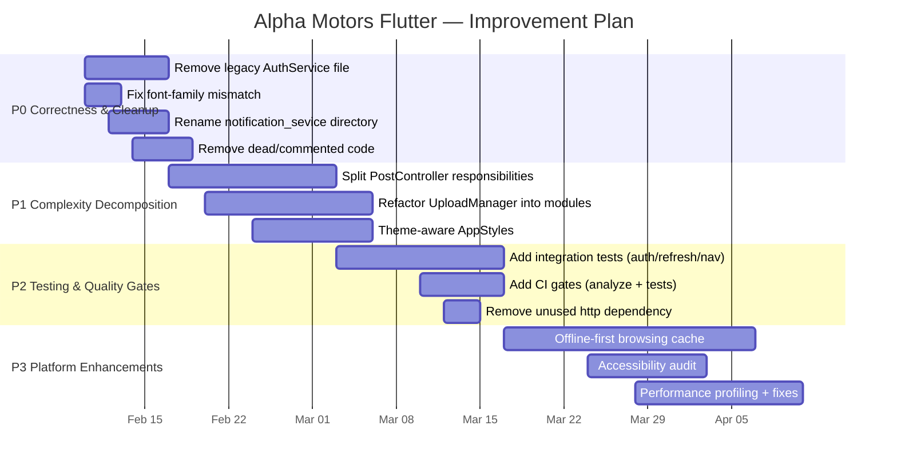

# Future Improvements — Alpha Motors (auto.tm) Flutter App

This is a prioritized roadmap focused on stability, maintainability, and delivery speed.

---

## Guiding Principles

- Prefer small, testable refactors over large rewrites.
- Reduce cognitive load: remove dead code and unify duplicate implementations.
- Keep networking centralized in `ApiClient` + services.
- Preserve UX: drafts, retries, and offline handling are important.

---

## Roadmap (P0 → P3)

### P0 — Correctness & Cleanup (high ROI)

- Remove dead legacy auth implementation (`lib/services/auth_service.dart`) or rename it clearly as deprecated.
- Consolidate auth flow docs and code around **canonical** `lib/services/auth/auth_service.dart`.
- Fix font family mismatch (declared family vs. used family) to avoid inconsistent typography.
- Rename `lib/services/notification_sevice/` → `notification_service/` and update imports.
- Remove unused/commented-out code that creates confusion (`TextConstants`, commented NotificationController).

### P1 — Decompose Complexity Hotspots

- Split `PostController` into:
  - `PostFormController` (fields, validation)
  - `PostMediaController` (picker/compress)
  - `PostSubmitController` (submission orchestration)
- Split `UploadManager` into:
  - `UploadStateMachine` (phase transitions)
  - `UploadPersistence` (snapshot save/restore)
  - `UploadTransport` (API calls)
- Make `AppStyles` theme-aware (avoid hard-coded colors; pull from `Theme.of(context).colorScheme`).

### P2 — Testing & Quality Gates

- Add integration tests for:
  - OTP send/verify
  - token refresh interceptor behavior
  - auth-gated navigation tabs (Post/Profile)
  - post creation flow (without real media uploads; use mocks)
- Add CI checks:
  - `flutter analyze`
  - `flutter test`
- Remove `http` dependency if not used anywhere (keep only Dio).

### P3 — Product/Platform Enhancements

- Offline-first strategy for browsing (cache posts/categories locally).
- Accessibility and UX audit (semantics, contrast, touch targets).
- Performance profiling (startup time, memory) and remediation.

---

## Timeline (illustrative)

---

## Notes

- The P0 items are intentionally chosen to reduce confusion and prevent future regressions.
- The P1 refactors should be done with tests in place (or added alongside) to preserve behavior.
