# Future Improvements — Alpha Motors (auto.tm) Flutter App

This is a prioritized roadmap focused on stability, maintainability, and delivery speed.

---

## Guiding Principles

- Prefer small, testable refactors over large rewrites.
- Reduce cognitive load: remove dead code and unify duplicate implementations.
- Keep networking centralized in `ApiClient` + services.
- Preserve UX: drafts, retries, and offline handling are important.

---

## Roadmap (P0 → P3)

### P0 — Correctness & Cleanup ✅ COMPLETE

- ✅ Remove dead legacy auth implementation (`lib/services/auth_service.dart`) — **DELETED**
- ✅ Fix font family mismatch (declared `Poppins` but using Inter font files) — **FIXED** to use `Inter` family
- ✅ Rename `lib/services/notification_sevice/` → `notification_service/` — **RENAMED** with all imports updated
- ✅ Remove unused/commented-out code (`TextConstants`, commented NotificationController) — **DELETED**

### P1 — Code Quality (IN PROGRESS)

**Status (FePb 9, 2026): PostController networking extraction in progress, Controller thinning continues**

#### What We Achieved (current)

- ✅ **PostController Network Decoupling**:
  - `postDetails()` post creation moved to `PostService`
  - Upload parts (`uploadVideo`, `uploadPhoto`) delegated to `PostService`
  - Removed direct `ApiClient` dependency from PostController
- ✅ **PostMediaController extraction**: Media picking/compression/player lifecycle moved out of PostController
  - **LOC**: PostMediaController is ~310 LOC
- ✅ **UploadPersistenceService extraction**: Crash recovery persistence isolated from UploadManager
  - **LOC**: UploadPersistenceService is ~160 LOC
- ✅ **UploadManager modularization**:
  - Integrated persistence service (removed inline GetStorage persistence methods)
  - Refactored weighted pipeline into focused helpers
  - **LOC**: UploadManager is ~1110 LOC
- ✅ **Quality gate**: **275 tests passing**, **0 failures**

#### Next Optimization Plan

**Goal**: "Thin Controllers" — Move all direct I/O and business logic to Services/Repositories.

**P1.1: Extract Network Logic from Controllers**
- [x] `PostController`: Delegate creation/upload to `PostService`
- [ ] `FavoritesController`: Extract `fetchFavoriteProducts`, `subscribe` to `FavoriteService`
- [ ] `FilterController`: Extract query building and fetching to `FilterService`
- [ ] `HomeController`: Extract feed fetching to `PostService` or `FeedService`
- [ ] `SearchScreenController`: Extract search index/scoring logic

**P1.2: Standardize Patterns**
- [ ] **Pagination**: Create a reuseable `PaginationController<T>` or mixin
- [ ] **Async State**: Standardize `status.isLoading/isError` handling
- [ ] **Error Handling**: Use `Failure` class everywhere instead of raw strings

**P1.3: Quality Gates**
- [ ] Add integration tests for critical flows (auth, upload recovery)
- [ ] Add CI pipeline config (GitHub Actions)

### P2 — Architecture & Robustness
- ✅ **UploadPersistenceService extraction** (Feb 8):
  - **Impact**: Created dedicated 164 LOC service for crash recovery logic
  - **UploadManager reduction**: 1148 → 1090 LOC (58 LOC, 5% reduction)
  - Isolated GetStorage operations for snapshot save/load/clear
  - Helper methods for controller hydration: `hydrateImages()`, `hasValidVideoFile()`
  - Crash recovery: Base64 photo encoding, video path persistence, automatic retry flow
  - Integrated into UploadManager: Replaced 60 LOC of persistence code with service calls
  - 18 new unit tests covering base64 decoding, video validation, snapshot edge cases
- ✅ **Pipeline method refactoring** (Feb 8):
  - **Impact**: Broke down monolithic 145 LOC `_runWeightedPipeline()` method
  - Extracted 3 focused methods: `_calculatePipelineWeights()` (40 LOC), `_createPipelineSteps()` (76 LOC), `_uploadMedia()` (68 LOC)
  - Main coordinator reduced to 20 LOC for improved readability
  - Improved testability: Weight calculation and media upload logic now independently testable
  - Named record syntax for weight tuple: `({double create, double media, double finalize})`
- ✅ **All tests passing**: 275 passing tests, 0 failures
- 🔄 **Add integration tests** for upload flow (photo/video selection → compression → upload orchestration)
- ⏳ **Extract shared utilities**: Move speed/ETA tracking, video compression helpers, and shared upload formatting into standalone utilities

#### Next Optimization Plan (better, more actionable)

**P1.1 — Make controllers thinner (highest ROI)**

- **Goal**: Controllers should coordinate state; services/repos should do I/O and heavy logic.
- **Target 1: PostController decomposition** (keep behavior identical)
  - Extract `PostFormController`: text fields + validation + dirty tracking
  - Extract `PostDraftService`: save/load drafts (GetStorage) + versioned schema
  - Extract `PostUploadCoordinator`: build `PostUploadSnapshot` + call UploadManager
  - Move all Dio calls out of PostController into `PostService`/`PostUploadService`
  - **Success criteria**: PostController drops from **1389 LOC** to **<500 LOC**, with tests added for snapshot building and orchestration.

**P1.2 — Standardize repeated patterns (reduce duplication)**

- **Pagination**: extract a reusable pagination helper/mixin used by Home/Filter/Search controllers
- **Async state**: replace scattered `isLoading/isRefreshing/...` flags with a single `AsyncState<T>` wrapper per feature
- **Error handling**: standardize network error mapping (timeout/offline/401/validation)

**P1.3 — Upload robustness & correctness**

- Add an integration test suite for crash recovery:
  - Persist snapshot → simulate restart → recover task → retry → ensure correct pipeline events
- Add explicit snapshot schema versioning (e.g. `ACTIVE_UPLOAD_TASK_V2`) to allow safe future evolution
- Add size limits/guardrails for base64 photo persistence (prevent storage bloat)

**P2 — Quality gates & regression prevention**

- Add CI steps:
  - `flutter analyze`
  - `flutter test`
- Add focused integration tests:
  - Auth refresh interceptor behavior
  - Auth-gated navigation tabs (Post/Profile)
  - Post creation flow (mock network; no real uploads)

**P3 — Performance & product polish (after stability)**

- Performance profiling targets:
  - cold start time
  - feed scrolling jank
  - memory while selecting many images/videos
- Offline-first browsing cache (posts/categories) with TTL + invalidation
- Accessibility audit (semantics, contrast, touch targets)

### P2 — Testing & Quality Gates

- Add integration tests for:
  - OTP send/verify
  - token refresh interceptor behavior
  - auth-gated navigation tabs (Post/Profile)
  - post creation flow (without real media uploads; use mocks)
- Add CI checks:
  - `flutter analyze`
  - `flutter test`
- Remove `http` dependency if not used anywhere (keep only Dio).

### P3 — Product/Platform Enhancements

- Offline-first strategy for browsing (cache posts/categories locally).
- Accessibility and UX audit (semantics, contrast, touch targets).
- Performance profiling (startup time, memory) and remediation.

---

## Timeline (illustrative)

```mermaid
gantt
  title Alpha Motors Flutter — Improvement Plan
  dateFormat  YYYY-MM-DD
  axisFormat  %b %d

  section P0 Correctness & Cleanup
  Remove legacy AuthService file            :p0a, 2026-02-10, 7d
  Fix font-family mismatch                 :p0b, 2026-02-10, 3d
  Rename notification_sevice directory     :p0c, 2026-02-12, 5d
  Remove dead/commented code               :p0d, 2026-02-14, 5d

  section P1 Complexity Decomposition
  Split PostController responsibilities     :p1a, 2026-02-17, 14d
  Refactor UploadManager into modules       :p1b, 2026-02-20, 14d
  Theme-aware AppStyles                     :p1c, 2026-02-24, 10d

  section P2 Testing & Quality Gates
  Add integration tests (auth/refresh/nav)  :p2a, 2026-03-03, 14d
  Add CI gates (analyze + tests)            :p2b, 2026-03-10, 7d
  Remove unused http dependency             :p2c, 2026-03-12, 3d

  section P3 Platform Enhancements
  Offline-first browsing cache              :p3a, 2026-03-17, 21d
  Accessibility audit                       :p3b, 2026-03-24, 10d
  Performance profiling + fixes             :p3c, 2026-03-28, 14d
```

---

## Test Coverage Summary

As of February 8, 2026, the project has **275 passing tests** (1 skipped) with **0 failures**:

### Service Layer Tests (91 tests)
- **TokenStore** (10 tests): Token persistence, reactive state, init hydration
- **AuthService** (16 tests): OTP send/verify flow, token storage, logout
- **BrandModelService** (22 tests): API fetching, cache fallback, search filtering, name resolution, TTL expiry
- **UploadPersistenceService** (18 tests): Base64 hydration, video validation, snapshot edge cases ✨ NEW
- **PostService** (2 tests): Fetch my posts, handle nested data
- **PhoneFormatter** (14 tests): Validation, formatting, extraction
- **Architecture** (3 tests): Layer separation enforcement, service existence, naming conventions
- **Other services** (6 tests): JWT validation, password hashing, API client

### Controller Tests (171 tests)
- **ProfileController** (26 tests): Profile fetching, state management, avatar upload
- **FilterController** (36 tests): Query building, filter counting, brand/model filtering
- **UploadManager** (15 tests): Snapshot serialization, task state management, progress tracking
- **PostMediaController** (17 tests): Image/video picking, compression, player lifecycle ✨ NEW
- **FavoritesController** (15 tests): Add/remove favorites, state management
- **PostController** (13 tests): DTO parsing, status extensions
- **SearchController** (11 tests): Search query handling, state management
- **RegisterController** (5 tests): OTP verification, external verification
- **Other controllers** (33 tests): Comment, blog, home screen widgets

### Model Tests (13 tests)
- **Post DTOs**: JSON parsing, nested object extraction, status mapping

### Code Extraction Impact
**PostController LOC reduction:** 1390 → 1090 LOC (~22% reduction)
- Extracted PostMediaController: ~300 LOC moved to dedicated controller
- Improved separation of concerns (media vs form vs upload)
- All media-related logic now isolated and independently testable

### Coverage Gaps
The following areas need more test coverage before refactoring:
- **PostController** upload orchestration (currently only DTO parsing tested)
- **UploadManager** pipeline execution (only state management tested, not actual upload logic)
- Integration tests for auth flow, token refresh, and navigation guards

---

## Notes

- The P0 items are intentionally chosen to reduce confusion and prevent future regressions.
- The P1 refactors should be done with tests in place (or added alongside) to preserve behavior.
