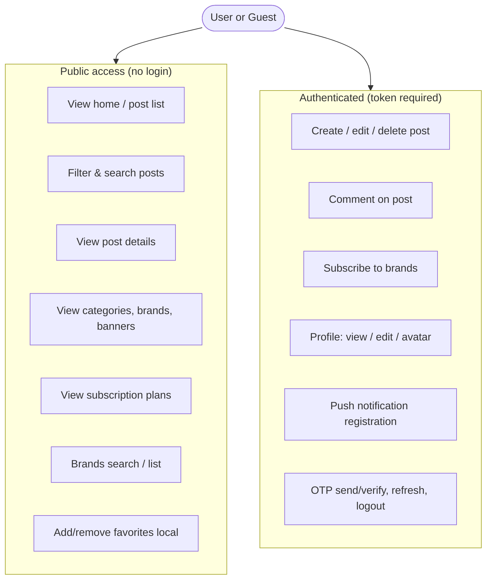
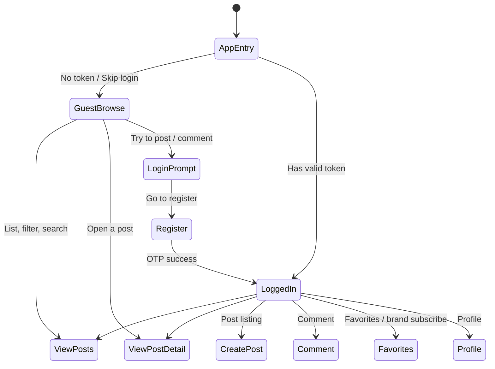

# Alpha Motors — Public vs Authenticated Access

This document defines the **access model**: what users can do **without registering** (public) and what **requires a token** (authenticated). It is the single source of truth for structuring the app and API around guest-friendly browsing.

---

## 1. Design Principle

| Access | Who | Purpose |
|--------|-----|--------|
| **Public (no token)** | Anyone, including guests | **Browse and discover**: view listings, filter, search, view post details, view categories/brands/banners. No account required. |
| **Favorites (local)** | Anyone | Add/remove favorites stored on device; list loaded via public `posts/list`. No login required. |
| **Authenticated (token required)** | Logged-in users only | **Create and interact**: post a listing, comment, subscribe to brands, edit profile, receive push notifications. |

**Rule of thumb:** If the action only **reads** catalog/content and does not create or modify user-specific data, it is public. **Favorites** are stored locally (GetStorage) and do not require a token. If the action **creates** or **modifies** server-side data tied to a user (post, comment, profile), it requires a token.

---

## 2. High-Level Access Model (Diagram)

---

## 3. User Journey: Guest vs Logged-In

**Target behavior:**

- **Guest:** Can open the app, see home (post list), use filters/search, open any post and see details, and add/remove favorites (stored locally). No login required for browsing or favorites. When they tap “Post” or “Comment”, the app shows a login/register prompt.
- **Logged-in user:** Same as guest, plus can post, comment, subscribe to brands, and use profile. All authenticated requests send the JWT.

---

## 4. API Endpoints: Public vs Token Required

Below reflects the **intended** model. Backend controllers are annotated where they already match; any mismatch is noted for alignment.

### 4.1 Public (no `Authorization` header)

| Resource | Method | Path (v1) | Purpose | Backend today |
|----------|--------|-----------|---------|----------------|
| Posts | GET | `posts` | List/filter posts | ✅ Public |
| Posts | GET | `posts/:uuid` | Single post details | ✅ Public |
| Posts | POST | `posts/list` | List by UUIDs (e.g. favorites list) | ✅ Public |
| Brands | GET | `brands` | List brands | ✅ Public |
| Brands | GET | `brands/search` | Search brands/models | ✅ Public |
| Brands | POST | `brands/list` | List brands by UUIDs | ✅ Public |
| Categories | GET | `categories` | List categories | ✅ Public |
| Categories | GET | `categories/:uuid` | Single category with posts | ✅ Public |
| Banners | GET | `banners` | List banners | ✅ Public |
| Banners | GET | `banners/:uuid` | Single banner | ✅ Public |
| Models | GET | `models` | List models | ✅ Public |
| Subscription | GET | `subscription` | List plans | ✅ Public |
| Subscription | GET | `subscription/:uuid` | Single plan | ✅ Public |
| Vlog | GET | `vlog` | List vlog entries | ✅ Public |
| Vlog | GET | `vlog/:id` | Single vlog entry | ✅ Public |
| Comments | GET | `comments?postId=...` | List comments by post | ✅ Public |
| Comments | GET | `comments/:id` | Single comment | ✅ Public |
| OTP | POST | `otp/send` | Request OTP | ✅ Public (rate-limited) |
| OTP | POST | `otp/verify` | Verify OTP, get tokens | ✅ Public |

**Favorites (local):** Favorite post UUIDs are stored on the client (GetStorage). Listing favorite posts uses public `POST posts/list` with those UUIDs. No auth required.

**Public (implemented):**

| Resource | Method | Path | Note |
|----------|--------|------|------|
| Comments | GET | `comments?postId=...` | ✅ Public — guests can read comments on a post. |
| Comments | GET | `comments/:id` | ✅ Public — single comment read. |
| Vlog | GET | `vlog/:id` | ✅ Public — guests can read a single vlog entry. |

### 4.2 Authenticated (token required)

| Resource | Method | Path (v1) | Purpose |
|----------|--------|-----------|---------|
| Auth | GET | `auth/me` | Current user profile |
| Auth | POST | `auth/refresh` | Refresh tokens (Bearer refresh) |
| Auth | POST | `auth/logout` | Logout |
| Auth | PUT | `auth` | Update profile |
| Auth | PUT | `auth/setFirebase` | Register FCM token |
| Auth | POST | `auth/avatar` | Upload avatar |
| Auth | DELETE | `auth/avatar` | Remove avatar |
| Posts | GET | `posts/me` | My posts |
| Posts | POST | `posts` | Create post |
| Posts | PUT | `posts/:uuid` | Update post |
| Posts | DELETE | `posts/:uuid` | Delete post |
| Comments | POST | `comments` | Create comment |
| Comments | PATCH / DELETE | `comments/:id` | Update / delete comment |
| Brands | POST | `brands/subscribe` | Subscribe to brand |
| Brands | POST | `brands/unsubscribe` | Unsubscribe |
| Subscription | POST | `subscription/order` | Create order (if applicable) |
| Vlog | POST | `vlog` | Create vlog |
| Vlog | PATCH/DELETE | `vlog/:id` | Update / delete vlog (GET is public) |

---

## 5. Request Flow (Backend)

---

## 6. Flutter App Structure (Target)

**Current state vs target:**

- **Current:** App **initial route is `/navView`** (main app). Guests already land on the main app and can browse Home, Favourites, Blog. Post and Profile tabs (and PostCheckPage / ProfileCheckPage) gate on `TokenStore.hasTokens` and redirect to `/register` when no token. The route `/` (AuthCheckPage) exists but is not used as initial route; if it were, it would require token or send to register.
- **Target:** Keep guest-friendly entry (main app without token). Screens that only use public APIs work without login. Favorites are stored locally; no login required. When the user taps “Post” or “Comment”, the app shows a login/register prompt. Backend: make GET comments (and optionally GET vlog/:id) public so guests can read them. See [ACCESS_MODEL_ROADMAP.md](ACCESS_MODEL_ROADMAP.md) for the full alignment audit and implementation roadmap.

---

## 7. Summary Matrix

| Area | Public (no token) | Token required |
|------|-------------------|-----------------|
| **Posts** | List, filter, get one, get list by UUIDs | Create, update, delete, “my posts” |
| **Brands / models** | List, search, list by UUIDs | Subscribe, unsubscribe |
| **Categories** | List, get one with posts | Admin CRUD |
| **Banners** | List, get one | Admin CRUD |
| **Comments** | Read by postId, get one | Create, update, delete |
| **Vlog** | List, get one | Create, update, delete |
| **Favorites** | Add/remove (local), list via `posts/list` | — (local only) |
| **Subscription** | List plans | Create order |
| **Auth** | OTP send/verify | me, refresh, logout, profile, avatar, setFirebase |

---

## 8. Backend Alignment Checklist

- [x] **Comments:** Remove `AuthGuard` from `GET /comments` (and optionally `GET /comments/:id`) so guests can read comments. Keep `AuthGuard` on POST/PATCH/DELETE.
- [x] **Vlog:** Optionally remove `AuthGuard` from `GET /vlog/:id` so guests can read a single vlog entry.
- [x] Ensure no other **read-only** catalog endpoints require auth unless there is a product reason.

---

## 9. Frontend Alignment Checklist

- [x] **Entry flow:** Allow navigating to main app (e.g. `/navView`) without a token for guest mode; show login only when a protected action is triggered.
- [x] **Public requests:** Use a client that does not attach `Authorization` for public endpoints when the user has no token (or use the same client and let backend ignore the header for public routes).
- [x] **Protected actions:** On “Post”, “Comment”, etc., if no token → show login/register prompt. Favorites are local; no login required.
- [x] **UI:** Guest prompt for Comment (and Post/Profile); favorites work for guests (local storage). Comments load for guests after backend A1.

---

## 10. Where This Is Referenced

- [docs/ACCESS_MODEL_ROADMAP.md](ACCESS_MODEL_ROADMAP.md) — **Implementation roadmap** and **current mobile app alignment audit** (entry flow, tab gating, TokenStore, public vs protected calls).
- [docs/ARCHITECTURE_OVERVIEW.md](ARCHITECTURE_OVERVIEW.md) — Links to this doc for access model.
- [backend/docs/API_REFERENCE.md](../backend/docs/API_REFERENCE.md) — Auth contract; endpoint list here is the access matrix.
- [backend/docs/ARCHITECTURE.md](../backend/docs/ARCHITECTURE.md) — Backend guards and routing; align public vs protected routes with this doc.
