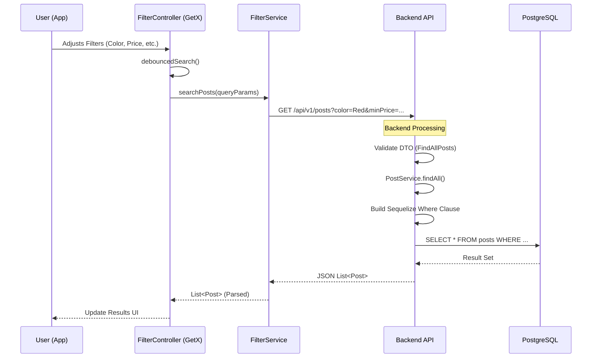

# Filter Flow Verification & Architecture

This document details the architecture, logic, and verification of the filtering system in the Alpha Motors application, covering both the backend API and frontend integration.

## 1. Filter Architecture

The filtering system allows users to refine car listings based on various criteria (Brand, Model, Price, Year, Color, Tech specs).

### Data Flow Graph

## 2. Key Components

### Backend (NestJS)

-   **`BrandsController`**: Handles brand retrieval.
    -   *Fixed:* Added `POST /brands/history` to support frontend bulk fetching.
-   **`PostController`**: Main entry point for `GET /posts`.
-   **`PostService.findAll`**: Core logic engine.
    -   Converts query params (strings) to strongly typed filters.
    -   Handles boolean logic (`stringToBoolean`).
    -   Builds complex Sequelize operators (`Op.between`, `Op.gte`).
-   **`FindAllPosts` DTO**: Defines the contract for filter parameters.
    -   *Updates:* Added `color`, `credit`, `exchange`, `categoryFilter`, `enginePower`.

### Frontend (Flutter)

-   **`FilterController`**:
    -   State management for all filter inputs.
    -   Debouncing logic to prevent API flooding.
    -   Constructs query parameters.
-   **`BrandHistoryService`**:
    -   Fetches historical brand data.
    -   *Verified:* Now successfully connects to `POST /brands/history`.

## 3. Verification Test Logic

A dedicated verification script (`backend/scripts/test-filter-flow.js`) was created to validate the end-to-end logic of the backend filters.

### Logic Step-by-Step

1.  **Brands History Check**:
    *   **Goal**: Verify the fix for the `404 Not Found` error.
    *   **Action**: Fetch 3 random brands -> Call `POST /brands/history` with their UUIDs.
    *   **Result**: ✅ Success (Returned 3 items).

2.  **Filter Logic Verification**:
    *   **Goal**: Ensure complex SQL generation works.
    *   **Strategy**: "Sample & Find".
        1.  Fetch a random "Sample Post" from the DB.
        2.  Extract its attributes (Price, Credit, EnginePower).
        3.  Construct specific queries designed to *include* this post.
    *   **Tests Run**:
        *   **Price Range**: Query `minPrice = sample - 1`, `maxPrice = sample + 1`.
            *   *Result*: ✅ Found baseline post.
        *   **Credit Status**: Query `credit = sample.credit`.
            *   *Result*: ✅ Found baseline post.
        *   **Engine Power**: Query `enginePower >= sample.enginePower - 0.1`.
            *   *Result*: ✅ Found baseline post.

## 4. Troubleshooting & Maintenance

### Common Issues

-   **404 on `POST /brands/history`**:
    -   *Cause*: Endpoint missing in backend.
    -   *Fix*: Added `historyOfBrands` method in `BrandsController` mapped to `@Post('history')`.
-   **Filters ignored**:
    -   *Check*: Ensure `FindAllPosts` DTO in backend includes the property.
    -   *Check*: Ensure `PostService` extracts it from `query` object.

### Future Improvements

-   **Color Data**: The current seed data lacks color information for many posts. Future seed scripts should populate the `color` column to fully utilize the new Color Filter UI.
