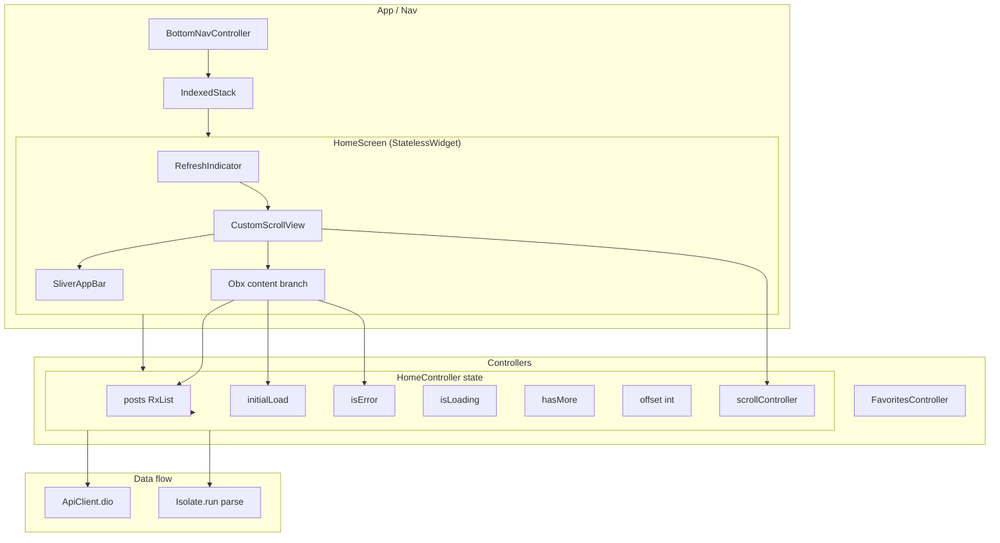
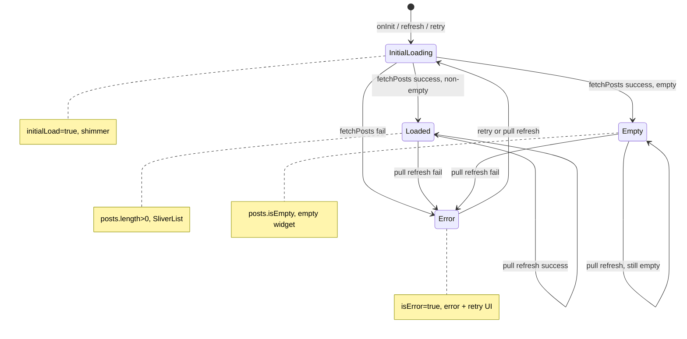
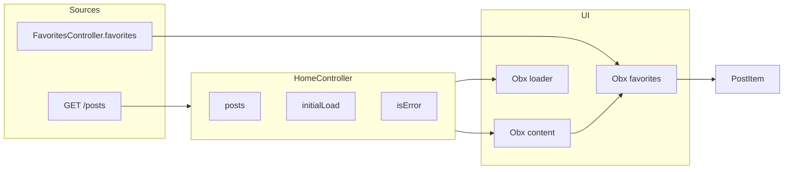

# Home Screen & Controller — Deep Analysis and Improvement Plan

This document analyses the home page end-to-end (controller, screen, widgets, and flow), lists issues, and proposes refactors and improvements with clear diagrams and a phased plan.

---

## 0. HomeController initialization (fix for "not found" error)

**Problem:** `HomeScreen` uses `Get.find<HomeController>()`, but when `BottomNavController` is constructed, its `final List<Widget> pages = [ HomeScreen(), ... ]` is initialized **before** `onInit()` runs. `HomeScreen()` construction triggers `Get.find<HomeController>()` immediately, while `Get.put(HomeController(), permanent: true)` lives in `BottomNavController.onInit()` — which runs only after construction. Result: "HomeController not found".

**Fix applied (Option A):** Register `HomeController` in `main.dart` `initServices()` before the nav is shown. `initServices()` runs before the first frame; when the user navigates to `/navView`, `HomeController` already exists. `HomeScreen` can safely `Get.find<HomeController>()`.

**File changed:** [main.dart](auto.tm-main/lib/main.dart) — added `Get.put(HomeController(), permanent: true)` in `initServices()` if not registered.

---

## 1. Current Architecture Overview

### 1.1 Component diagram



*Note:* FilterController is no longer used by HomeScreen (removed in refactor).

**See also:** [HOME_SCREEN_FLOW_AND_ANALYSIS.md](HOME_SCREEN_FLOW_AND_ANALYSIS.md) for current flow, dead code, and image loading (§10).

### 1.2 State and UI flow



### 1.3 Sequence: load and refresh

```mermaid
sequenceDiagram
  participant User
  participant HomeScreen
  participant HomeController
  participant ApiClient
  participant Isolate

  User->>HomeScreen: Open app / switch to Home tab
  HomeScreen->>HomeController: Get.find (already created by Nav)
  HomeController->>HomeController: onInit: fetchInitialData()
  HomeController->>HomeController: initialLoad=true, isError=false
  HomeController->>HomeController: fetchPosts()
  HomeController->>HomeController: isLoading=true
  HomeController->>ApiClient: GET posts?offset=0&limit=20...
  ApiClient-->>HomeController: response
  alt response 200 and data List
    HomeController->>Isolate: run(parse List -> Post)
    Isolate-->>HomeController: newPosts
    HomeController->>HomeController: posts.addAll, offset+=20
  else error or non-200
    HomeController->>HomeController: (no isError set)
  end
  HomeController->>HomeController: initialLoad=false, isLoading=false
  HomeScreen->>User: Show list / empty / error

  User->>HomeScreen: Pull to refresh
  HomeScreen->>HomeController: refreshData()
  HomeController->>HomeController: clear posts, offset=0, hasMore=true
  HomeController->>HomeController: fetchInitialData()
  Note over HomeController: Same flow as above; Future always completes
```

---

## 2. Issues Identified

### 2.1 Controller (HomeController)

| # | Issue | Severity | Location |
|---|--------|----------|----------|
| 1 | **Non-200 / null data not treated as error** — When `response.statusCode != 200` or `response.data == null`, `isError` is never set; user sees empty or stale list with no feedback. | High | `fetchPosts()` |
| 2 | **Scroll listener can throw** — `scrollController.position` is used without checking `scrollController.hasClients` or that the position is attached (e.g. before first layout). | Medium | `onInit()` listener |
| 3 | **Pagination trigger is exact match** — `maxScrollExtent == scrollController.offset` may rarely fire (floating point); also no small threshold to start loading earlier. | Low | `onInit()` listener |
| 4 | **FlutterNativeSplash.remove() in fetchInitialData** — Called on every initial load (including retry/refresh). Works but couples splash to home fetch; if home is not the first screen, splash might already be removed elsewhere. | Low | `fetchInitialData()` finally |
| 5 | **Unused import** — `dart:convert` is not used. | Trivial | Top of file |
| 6 | **Magic numbers** — Page size `20` and offset increment repeated; no named constant. | Low | `fetchPosts()` |
| 7 | **Duplicate snackbar logic** — Same snackbar shown in `fetchInitialData` both when `isError` is set by `fetchPosts` and in catch block. | Low | `fetchInitialData()` |

### 2.2 Home screen (home_screen.dart)

| # | Issue | Severity | Location |
|---|--------|----------|----------|
| 8 | **Dead dependency** — `filterController` is declared and injected but never used on the screen (only `BrandSelection` is used via `Get.to`). | Low | HomeScreen fields |
| 9 | **Header duplication** — `_FilterBar` and `_PostsHeader` are repeated in four places: shimmer, error, empty, and data view. Any change must be done in four spots. | Medium | All `_buildSliver*` methods |
| 10 | **Nested Obx in data view** — Outer `Obx` for favorites, inner `Obx` for pagination loader; works but makes reactivity harder to reason about and can rebuild more than needed. | Low | `_buildSliverDataView` |
| 11 | **FavoritesController put in build** — `Get.put(FavoritesController())` inside `_buildSliverDataView` runs on every rebuild of that branch; idempotent but unnecessary work. | Low | `_buildSliverDataView` |
| 12 | **Large single file** — Home screen + four private widget classes (~420 lines); harder to test and navigate. | Medium | File structure |

### 2.3 PostItem and list

| # | Issue | Severity | Location |
|---|--------|----------|----------|
| 13 | **Get.find in getter** — `_favoritesController` is a getter that calls `Get.find<FavoritesController>()` on every access; fine for tap, but could be resolved once per widget if needed. | Low | PostItem |
| 14 | **childCount reactive** — `childCount: 1 + controller.posts.length + 1` is read inside Obx; when posts change the whole SliverList is recreated. Correct but rebuilds the whole list. | Low | SliverChildBuilderDelegate |

### 2.4 Flow and behaviour

| # | Issue | Severity | Description |
|---|--------|----------|-------------|
| 15 | **Refresh shows full shimmer** — `refreshData()` clears list and calls `fetchInitialData()`, so `initialLoad` is true and full shimmer is shown. Acceptable but heavier than “refresh in place”. | Low | UX |
| 16 | **No connectivity check** — Fetch is attempted even when offline; error appears only after request fails. | Low | UX / Phase 4 |

---

## 3. Improvement Approaches

### 3.1 Refactor by concern (recommended)

- **Controller**: single responsibility (home feed state + API + pagination). Extract API/parse into a small repository or service if you want to test or reuse.
- **Screen**: only composition and branching; move “header” (filter bar + posts header) into one reusable widget and use it in all four states.
- **State**: consider one sealed type or enum for `HomeViewState` (InitialLoading | Loaded | Empty | Error) so the UI is a single switch on state instead of multiple booleans.

### 3.2 Code quality

- **Constants**: `kHomePageSize = 20` (and use for limit and offset increment).
- **Scroll safety**: guard listener with `scrollController.hasClients` and optional threshold, e.g. `position.pixels >= position.maxScrollExtent - 200`.
- **Error handling**: treat non-200 or null `response.data` as error (set `isError`, optional message from body).
- **Remove dead code**: drop unused `filterController` and `dart:convert` import.

### 3.3 Structure

- **Extract widgets**: move `_FilterBar`, `_PostsHeader`, `_ErrorRetry`, `_EmptyPosts` to `home_screen/widgets/` (e.g. `home_filter_bar.dart`, `home_posts_header.dart`, etc.) and import in `home_screen.dart`.
- **Single header sliver**: one widget that builds “filter bar + posts header” and is used in shimmer, error, empty, and data view to remove duplication.

### 3.4 Optional enhancements

- **Refresh in place**: on pull-to-refresh, keep showing current list and a small “Refreshing…” indicator; replace list on success, show error banner on failure.
- **Connectivity**: before fetch, if you have a connection controller, show “No internet” and retry when back online.
- **Caching**: optional simple cache (e.g. last list in memory or persistent) and show it immediately on open while refreshing in background.

---

## 4. Refactor and Improvement Plan (Phased)

### Phase A — Controller robustness and clarity (high impact, low risk)

| Step | Action | Files |
|------|--------|--------|
| A1 | Treat non-200 or null `response.data` as error: set `isError` and `errorMessage` (e.g. from `response.data['message']` or status code). | `home_controller.dart` |
| A2 | Guard scroll listener: check `scrollController.hasClients` and optionally use a threshold (e.g. `pixels >= maxScrollExtent - 200`) before calling `fetchPosts()`. | `home_controller.dart` |
| A3 | Introduce `static const int kHomePageSize = 20` and use it for `limit` and offset increment. | `home_controller.dart` |
| A4 | Remove unused `dart:convert` import. | `home_controller.dart` |
| A5 | Optionally: show snackbar only once (e.g. in `fetchInitialData` catch, and after `await fetchPosts()` if `isError.value`), to avoid duplicate snackbars. | `home_controller.dart` |

**Outcome:** Reliable error handling for all failure cases, safe scroll listener, clearer constants, less noise.

---

### Phase B — Screen structure and duplication (medium impact)

| Step | Action | Files |
|------|--------|--------|
| B1 | Remove unused `filterController` from `HomeScreen`. | `home_screen.dart` |
| B2 | Create a single “header” widget (e.g. `HomeSliverHeader` or `_HomeHeader`) that contains `_FilterBar` + `_PostsHeader` and use it in all four content builders (shimmer, error, empty, data). | `home_screen.dart` (and optionally a new widget file) |
| B3 | Move `Get.put(FavoritesController())` to screen level (e.g. in `build` or a single place) so it is not inside the Obx that rebuilds with favorites. | `home_screen.dart` |

**Outcome:** No dead dependency, one place to change header layout, slightly clearer build flow.

---

### Phase C — Extract widgets and optional state type (optional, improves testability)

| Step | Action | Files |
|------|--------|--------|
| C1 | Extract `_FilterBar` to `widgets/home_filter_bar.dart` (or keep private but in same file; if extracted, pass theme/callbacks). | New file or `home_screen.dart` |
| C2 | Extract `_PostsHeader`, `_ErrorRetry`, `_EmptyPosts` similarly so `home_screen.dart` is mostly composition. | New files |
| C3 | (Optional) Introduce `HomeViewState` (e.g. sealed class or enum: InitialLoading, Loaded, Empty, Error) and derive it in controller from `initialLoad`, `isError`, `posts.isEmpty`; UI does a single switch on state. | `home_controller.dart`, `home_screen.dart` |

**Outcome:** Smaller, focused files; easier unit tests; single source of truth for “what to show”.

---

### Phase D — Polish (optional)

| Step | Action | Files |
|------|--------|--------|
| D1 | Refresh in place: in `refreshData()` do not set `initialLoad = true`; keep list visible, set a small “isRefreshing” flag; on success replace list, on failure show snackbar or inline error. | `home_controller.dart`, `home_screen.dart` |
| D2 | Connectivity: before fetch, if connection controller says offline, set error state with “No internet” and optionally retry when connectivity returns. | `home_controller.dart` |
| D3 | Consider moving splash removal to a single app-level place (e.g. after first frame or after auth check) instead of inside home fetch. | `main.dart` / `app.dart`, `home_controller.dart` |

---

## 5. Dependency and data flow (current)



---

## 6. Suggested order and priority

| Priority | Phase | Focus |
|----------|--------|--------|
| 1 | A | Controller: non-200 handling, scroll guard, constants, imports |
| 2 | B | Screen: remove dead field, single header widget, FavoritesController placement |
| 3 | C | Optional: extract widgets, optional HomeViewState |
| 4 | D | Optional: refresh in place, connectivity, splash |

Implementing **Phase A** and **Phase B** gives the largest benefit with minimal structural change. **Phase C** and **Phase D** improve long-term maintainability and UX polish.

---

## 7. Files to touch (summary)

| File | Phase A | Phase B | Phase C | Phase D |
|------|---------|---------|---------|---------|
| `home_screen/controller/home_controller.dart` | A1–A5 | — | C3 (optional) | D1, D2, D3 |
| `home_screen/home_screen.dart` | — | B1–B3 | C2, C3 | D1 |
| `home_screen/widgets/home_filter_bar.dart` (new) | — | — | C1 | — |
| `home_screen/widgets/home_posts_header.dart` (new) | — | — | C2 | — |
| `home_screen/widgets/home_error_retry.dart` (new) | — | — | C2 | — |
| `home_screen/widgets/home_empty_posts.dart` (new) | — | — | C2 | — |

This gives a clear path from “fix correctness and robustness” (A) to “reduce duplication and improve structure” (B), then optional “extract and formalise state” (C–D).
