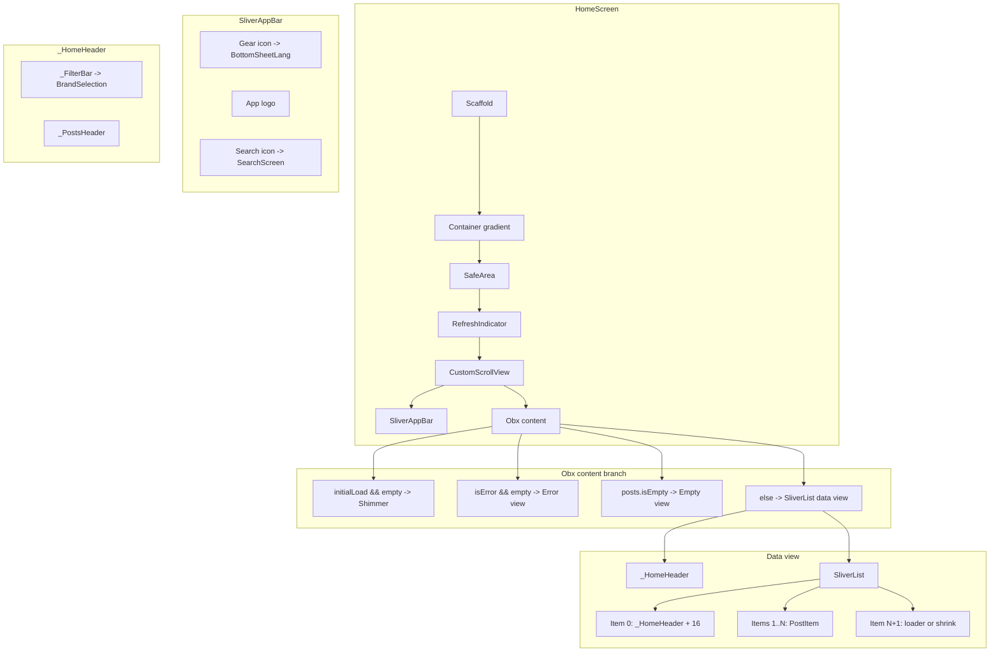
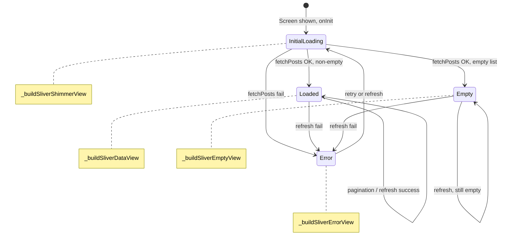
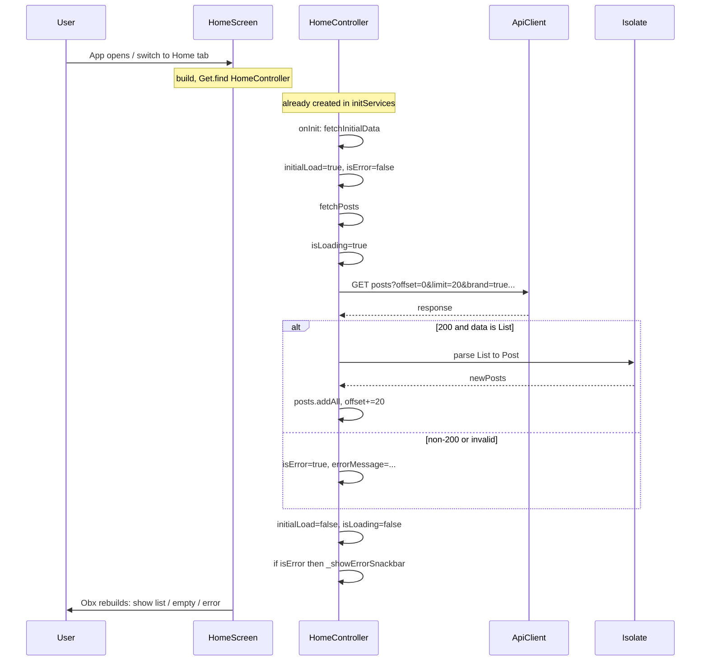
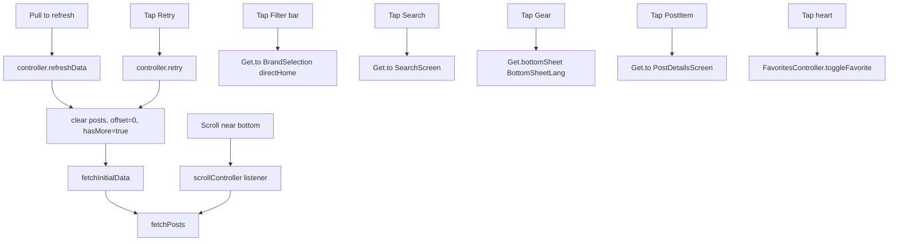
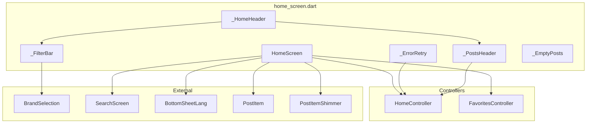
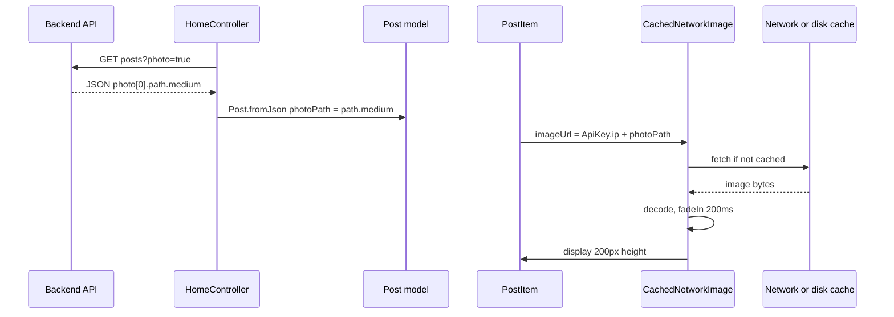

# Home Screen — Full Flow, Graphs, Dead Code & Improvements

This document describes the **entire home screen flow** with diagrams, then lists **dead/unused code** and **improvements**.

**See also:** Phased improvement plan (Phase A–D) and component/state diagrams: [HOME_SCREEN_ANALYSIS.md](HOME_SCREEN_ANALYSIS.md).

---

## 1. How the home screen is reached

```mermaid
flowchart LR
  subgraph AppStart [App start]
    main[main]
    init[initServices]
    main --> init
    init --> PutHome[Get.put HomeController permanent]
  end

  subgraph Nav [Navigation]
    route["initialRoute: /navView"]
    navView[BottomNavView]
    putNav[Get.put BottomNavController]
    route --> navView
    navView --> putNav
    putNav --> pages[pages = [ HomeScreen, ... ]]
    pages --> findHome[HomeScreen: Get.find HomeController]
  end

  PutHome --> findHome
```

- **main.dart**: `initServices()` runs before `runApp`, and registers `HomeController` with `Get.put(..., permanent: true)`.
- **First frame**: App shows `initialRoute: '/navView'` → `BottomNavView` builds → `Get.put(BottomNavController())` → `pages` list is built → `HomeScreen()` is created → `Get.find<HomeController>()` succeeds because it was already put in `initServices()`.
- **IndexedStack**: All tab pages (including `HomeScreen`) are kept in the tree; switching tabs does not dispose `HomeScreen` or `HomeController`.

---

## 2. Home screen widget tree and data flow



**Controllers used by HomeScreen:**

- **HomeController** (`Get.find`): `posts`, `initialLoad`, `isError`, `scrollController`, `refreshData`, `retry`, etc.
- **FavoritesController** (`Get.put`): `favorites` (for `isFav` on each `PostItem`).

**No longer used on this screen:** `FilterController` (removed in Phase B). Filter bar opens `BrandSelection(origin: 'directHome')` directly.

---

## 3. State machine and UI mapping



| State            | Condition                                      | UI |
|------------------|------------------------------------------------|----|
| Initial loading  | `initialLoad.value && posts.isEmpty`           | _HomeHeader (ignorePointer) + 5× PostItemShimmer |
| Error            | `isError.value && posts.isEmpty`               | _HomeHeader + _ErrorRetry |
| Empty            | `posts.isEmpty` (and not loading, not error)   | _HomeHeader + _EmptyPosts |
| Loaded           | `posts.isNotEmpty`                             | _HomeHeader + SliverList (PostItem + pagination slot) |

---

## 4. Data flow: from open to list



---

## 5. User actions and reactions



---

## 6. Home controller API surface

| Member            | Purpose |
|-------------------|--------|
| `scrollController` | Attached to `CustomScrollView`; scroll listener for pagination. |
| `posts`           | Rx list of `Post`; drives list and item count. |
| `initialLoad`     | True during first fetch; drives shimmer. |
| `isLoading`       | True during fetch (initial or pagination); drives footer loader. |
| `hasMore`         | False when last page returned empty. |
| `offset`          | Next request offset (incremented by `kHomePageSize`). |
| `isError`         | True when last fetch failed; drives error view. |
| `errorMessage`    | Set on error; **not currently shown in UI** (see improvements). |
| `fetchInitialData()` | First load / retry / refresh; sets initialLoad, calls fetchPosts, snackbar on error. |
| `fetchPosts()`     | GET posts, parse in isolate, update posts/offset/hasMore/isError. |
| `retry()`         | Clear error + posts, reset offset/hasMore, then fetchInitialData. |
| `refreshData()`   | Same reset then fetchInitialData; used by RefreshIndicator. |
| `scrollToTop()`   | Called from nav when user re-taps Home tab. |

---

## 7. Dead / unused code (home screen area)

### 7.1 In `home_screen.dart`

- **Commented import**: `// import 'package:auto_tm/screens/home_screen/widgets/banner_slider.dart'` — BannerSlider is disabled; comment can be removed or kept for re-enable.
- **Commented import**: `// import 'package:auto_tm/screens/post_details_screen/model/post_model.dart'; // not used directly here` — Not used; can be removed.
- **Comment**: `// use surface instead of deprecated background` — Informational only.

### 7.2 Controllers / widgets not used by current home screen

- **BannerController** and **BannerSlider**: Not used on home (BannerSlider is commented out). Used only if you re-enable the banner.
- **CategoryController**, **Categories**, **CategoryPosts**: Not referenced from `home_screen.dart` or from the nav flow that builds the home tab. They are unused by the **current** home screen (may be used elsewhere or planned).
- **widgets/filter_bar.dart** (public `FilterBar`): Home uses an inline `_FilterBar` that opens `BrandSelection(origin: 'directHome')`. The standalone `FilterBar` in `widgets/filter_bar.dart` opens `FilterScreen()` and is **not referenced** anywhere; it is dead code unless another screen imports it.

### 7.3 HomeController

- **errorMessage**: Set on every error path but never read by the UI. The error view shows only generic `home_error_title` and `home_error_tap_retry`; the actual message is not displayed.

---

## 8. Improvements

### 8.1 Show error message in UI (high value)

- In **HomeController**, `errorMessage` is already set on failure.
- In **_ErrorRetry**, show `controller.errorMessage.value` (e.g. below the title or as subtitle) when non-empty, so users see the real reason (e.g. "Request failed (500)", network error).
- Optionally truncate or sanitize for very long messages.

### 8.2 Remove dead / commented code (low risk)

- Remove the commented `banner_slider` and `post_model` imports from `home_screen.dart`.
- If you do not plan to use the standalone **FilterBar** from `widgets/filter_bar.dart`, delete the file or document that it is legacy; otherwise no home screen change.

### 8.3 Categories / banner (product decision)

- **Categories** and **CategoryPosts** (and **CategoryController**): Either integrate them into the home screen (e.g. a section above the list) or remove/relocate if the feature is abandoned.
- **BannerSlider**: Either re-enable on home (uncomment and add to _HomeHeader or below it) or remove the commented reference and consider removing BannerController from home module if nothing else uses it on home.

### 8.4 Optional: Extract private widgets to files

- Move `_HomeHeader`, `_FilterBar`, `_PostsHeader`, `_ErrorRetry`, `_EmptyPosts` into `home_screen/widgets/` (e.g. `home_header.dart`, `home_filter_bar.dart`, …) for smaller files and easier testing. Keep the same behavior and state flow.

### 8.5 Optional: Refresh in place

- On pull-to-refresh, keep showing the current list and a small “Refreshing…” indicator instead of going back to full shimmer. Replace list on success; on failure show snackbar or inline error and keep current list.

---

## 9. File dependency overview



**Not used by current home flow:**  
BannerController, BannerSlider, CategoryController, Categories, CategoryPosts, widgets/filter_bar.dart (public FilterBar).

---

## 10. Home screen image flow

Images on the home screen follow this path: API (photo path) → Post model → PostItem → CachedNetworkImage → cache and display.

### 10.1 Sequence (API to display)



### 10.2 Summary

- **Backend:** Photo entity has `path: { small, medium, large }` (Sharp resizes on upload). Posts response includes photo when `photo: true`.
- **Client size:** Post model uses **medium** for `photoPath` (list and detail both use medium today).
- **URL:** PostItem builds full URL as `ApiKey.ip + photoPath`.
- **Cache:** CachedNetworkImage uses flutter_cache_manager (disk + memory); repeat visits and scroll-back use cache.
- **Placeholder:** Shimmer (theme colors), same size as image (200 height, rounded top); no layout jump.
- **Reveal:** fadeInDuration 200ms, fadeInCurve easeOut; errorWidget shows SVG fallback.

### 10.3 Optional improvements

| Area | Current | Optional improvement |
|------|--------|----------------------|
| **Decode size** | No memCacheWidth/memCacheHeight | Set memCacheWidth (e.g. 400–600) in PostItem to cap decoded bitmap and reduce memory. |
| **List vs detail size** | List and detail both use medium | Use small for list (PostItem) if API exposes path.small; keep medium/large for post detail. |
| **Preloading** | No explicit preload | Preload next few image URLs when a cell is visible (e.g. precacheImage or CachedNetworkImageProvider). |
| **Cache policy** | Default CacheManager | Custom CacheManager with stalePeriod/maxNrOfCacheObjects if TTL or refresh is required. |

---

## 11. Summary

| Topic | Summary |
|-------|--------|
| **Entry** | HomeController is put in `initServices()`; HomeScreen finds it when nav builds `pages`. |
| **State** | Four states: Initial loading (shimmer), Error, Empty, Loaded; single Obx branches on controller observables. |
| **Data** | GET posts → isolate parse → `posts.addAll`; pagination via scroll listener; refresh/retry reset and refetch. |
| **Images** | API medium path → Post.photoPath → CachedNetworkImage (shimmer, fade-in, cache); see §10. |
| **Dead code** | Commented imports (banner_slider, post_model); unused `errorMessage` in UI; standalone `FilterBar` in widgets/filter_bar.dart; Categories/CategoryPosts/CategoryController not used on home. |
| **Improvements** | Show `errorMessage` in error view; remove commented imports; optionally re-enable or remove banner/categories; optionally extract widgets and refresh-in-place; image improvements in §10.3. |

This gives a single place for the full home screen flow (with graphs), dead/unused code, image flow, and a concrete improvement list.
