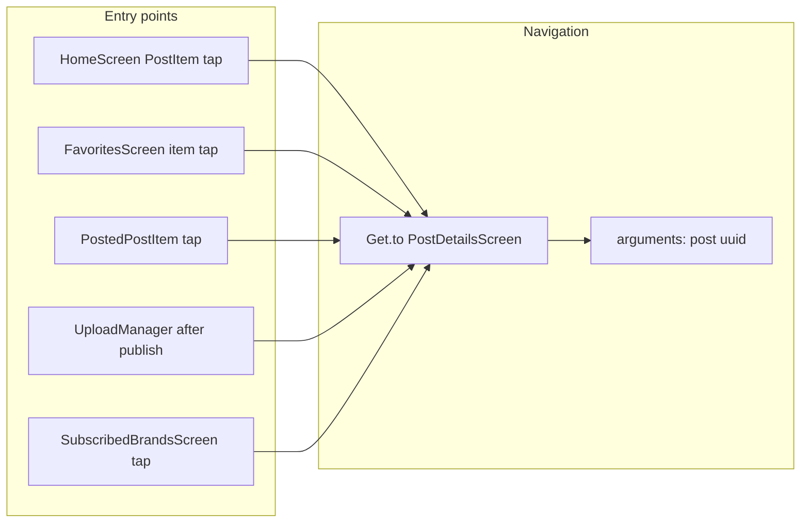
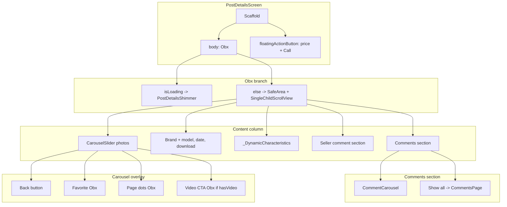
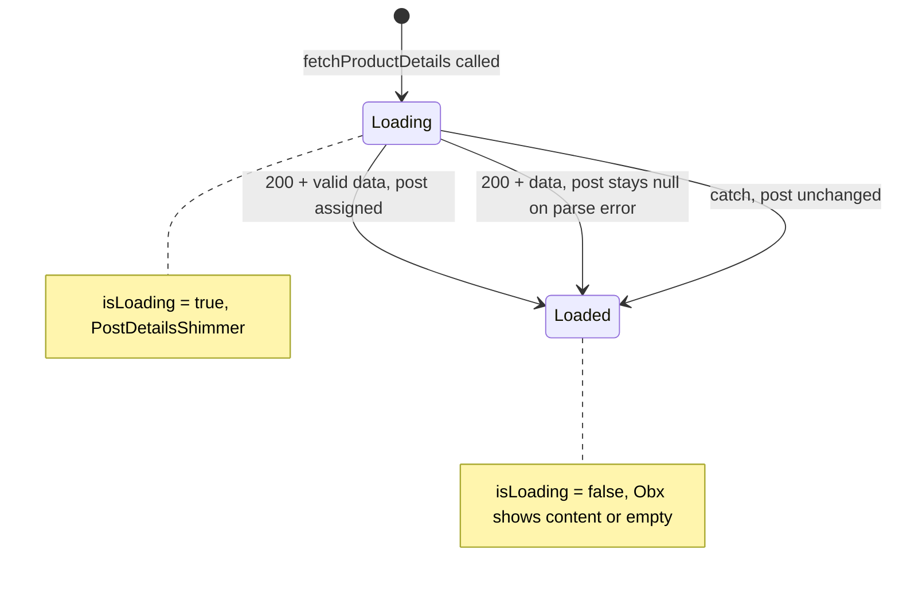
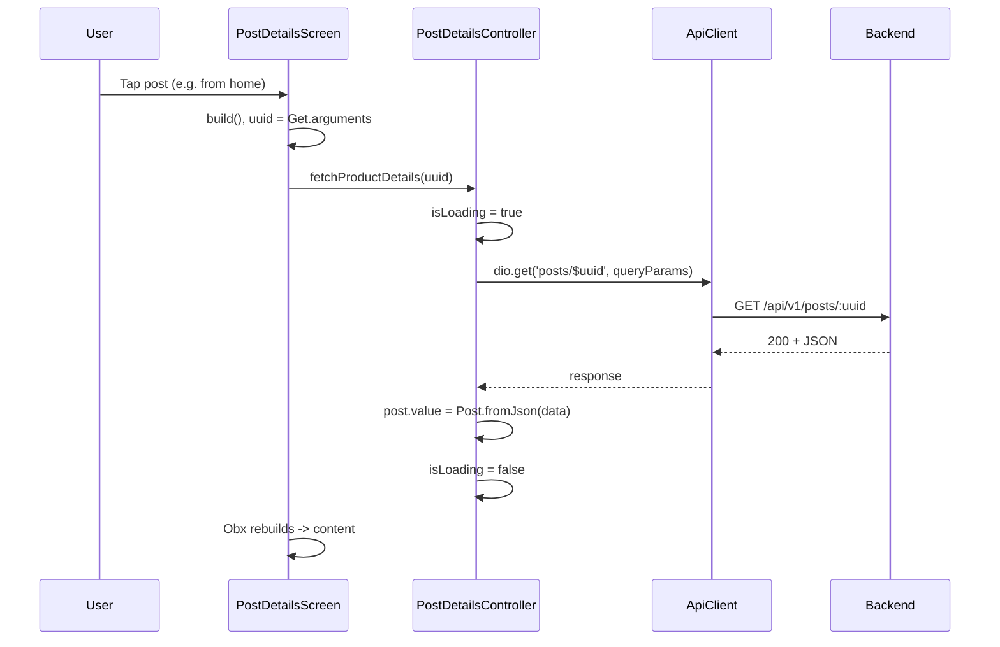
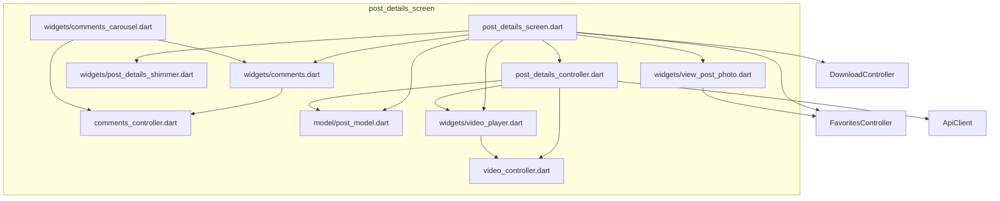

# Post Details Screen — Full Flow, Data Flow, Dead Code & Improvements

This document describes the **post details screen** end-to-end: how it is reached, widget tree, data flow, controllers, **dead/unused code**, and **open improvements**.

---

## 1. How the post details screen is reached

- **No named route:** The screen is pushed via `Get.to(() => PostDetailsScreen(), arguments: uuid)` from:
  - [post_item.dart](auto.tm-main/lib/screens/home_screen/widgets/post_item.dart) (home list)
  - [favorites_screen.dart](auto.tm-main/lib/screens/favorites_screen/favorites_screen.dart)
  - [posted_post_item.dart](auto.tm-main/lib/screens/post_screen/widgets/posted_post_item.dart)
  - [upload_manager.dart](auto.tm-main/lib/screens/post_screen/controller/upload_manager.dart) (after successful publish)
  - [subscribed_brands_screen.dart](auto.tm-main/lib/screens/favorites_screen/widgets/subscribed_brands_screen.dart)
- **Arguments:** `Get.arguments` is the post UUID (String). The screen reads it once as `final String uuid = Get.arguments;`.

---

## 2. Post details screen widget tree and data flow

**Controllers used by PostDetailsScreen:**

| Controller | How obtained | Purpose |
|------------|--------------|---------|
| PostDetailsController | `Get.put(PostDetailsController())` | `post`, `isLoading`, `currentPage`, `fetchProductDetails(uuid)`, `setCurrentPage`, `makePhoneCall` |
| FavoritesController | `Get.put(FavoritesController())` | `favorites.contains(uuid)`, `toggleFavorite(uuid)`, `formatDate` |
| DownloadController | `Get.find<DownloadController>()` | `isDownloading`, `progress`, `startDownload` (when post has file) |

**Child screens / dialogs:**

- **ViewPostPhotoScreen:** Full-screen photo viewer (imageUrls, currentIndex, postUuid). Opened from carousel image tap.
- **VideoPlayerPage:** Full-screen video (FullVideoPlayerController). Opened from “Watch video” CTA; arguments = `post.value!.video` (String).
- **CommentsPage:** Full comments list + reply. Opened via “Show all”; arguments = post uuid (or map with postId + replyTo).

---

## 3. State and data flow

### 3.1 Post details state (PostDetailsController)

- **No explicit error state:** On API failure or exception, `fetchProductDetails` sets `isLoading.value = false` and returns without setting `post`. The UI shows the previous `post` (or empty) with no error message or retry.
- **Fetch trigger:** `detailsController.fetchProductDetails(uuid)` is called inside `build()`, so **every rebuild refetches** (see improvements).

### 3.2 Comments state (CommentsController)

- **CommentCarousel** and **CommentsPage** both use `Get.put(CommentsController())`. First one to build creates the controller; the other reuses it (same post context when opened from same details screen).
- **CommentCarousel** calls `controller.fetchComments(postId)` in its `build()` — so **comments are refetched on every carousel rebuild** (see improvements).
- States: `isLoading`, `comments`, `isSending`, `replyToComment`, `threadExpanded`.

### 3.3 Sequence: load post and open details

---

## 4. API and data flow summary

| Data | Source | Consumer |
|------|--------|----------|
| Post by UUID | `ApiClient.dio.get('posts/$uuid', queryParameters: { model, brand, photo })` | PostDetailsController.post |
| Comments | `ApiClient.dio.get('comments', queryParameters: { postId })` | CommentsController.comments |
| Create comment | `ApiClient.dio.post('comments', data)` | CommentsController.sendComment |
| Favorites | FavoritesController (GetStorage + public `posts/list`) | Favorite button, ViewPostPhotoScreen |
| Download | DownloadController (FlutterDownloader) | PDF download button when post.file present |

**Post model** ([post_model.dart](auto.tm-main/lib/screens/post_details_screen/model/post_model.dart)): `Post` holds a single `String? video` (from backend `video.publicUrl` or `video.url`). The `Video` class exists (with `url` list, `partNumber`) but **is not used by the details screen** for navigation; the screen passes `post.value!.video` (String) to VideoPlayerPage.

---

## 5. File dependency diagram

**External:** ApiClient, FavoritesController, DownloadController, ApiKey (key.dart), NavigationUtils, theme/styles/images.

---

## 6. Dead / unused code

### 6.1 Controllers

| Location | Item | Reason |
|----------|------|--------|
| [post_details_controller.dart](auto.tm-main/lib/screens/post_details_screen/controller/post_details_controller.dart) | `isPlaying` (RxBool) | Never read or set. |
| [post_details_controller.dart](auto.tm-main/lib/screens/post_details_screen/controller/post_details_controller.dart) | `showVideoPage(Video video)` | Never called. The screen navigates to VideoPlayerPage with `arguments: detailsController.post.value!.video` (String). Video URL list building and ordering live here but are unused. |
| [comments_controller.dart](auto.tm-main/lib/screens/post_details_screen/controller/comments_controller.dart) | `userId` (var "") | Never set or read anywhere. |

### 6.2 Model

| Location | Item | Reason |
|----------|------|--------|
| [post_model.dart](auto.tm-main/lib/screens/post_details_screen/model/post_model.dart) | `Video` class | Post stores `String? video`; details screen passes that string to VideoPlayerPage. `Video` (with url list, partNumber) is only used inside `PostDetailsController.showVideoPage`, which is dead. |
| [post_model.dart](auto.tm-main/lib/screens/post_details_screen/model/post_model.dart) | `Post.toJson()` | Empty implementation, unused. |

### 6.3 Constants / keys

| Location | Item | Reason |
|----------|------|--------|
| [key.dart](auto.tm-main/lib/utils/key.dart) | `ApiKey.getPostDetailsKey` | Defined as `"${apiKey}posts/"` but never referenced in the codebase. |

### 6.4 Commented / obsolete UI blocks (post_details_screen.dart)

- Large commented block: alternate video button (ElevatedButton/Ink) ~lines 339–415.
- Commented download section (LinearProgressIndicator + “Download PDF” button) ~lines 417–424; replaced by current download UI.
- Commented “Comments” row with IconButton navigating to CommentsPage ~lines 455–469.
- Commented duplicate “Show all” ElevatedButton ~lines 471–478.
- Commented `// final photos = post.photoPaths;` and similar one-off comments.

These can be removed to reduce noise and avoid confusion.

---

## 7. Open improvements

### 7.1 Robustness and correctness

| # | Improvement | Location | Notes |
|---|-------------|----------|--------|
| 1 | **Fetch post once per screen open** | post_details_screen.dart | `fetchProductDetails(uuid)` is called in `build()`, so every rebuild triggers a new request. Use a one-time fetch (e.g. in controller `onInit()` or when `uuid` is set, or guard with “last fetched uuid” and skip if same). |
| 2 | **Fetch comments once per postId** | comments_carousel.dart | `controller.fetchComments(postId)` is called in `build()`, causing repeated GET comments. Fetch in initState/lifecycle or when postId changes, and guard so the same postId is not refetched unnecessarily. |
| 3 | **Error state and retry for post details** | PostDetailsController | On non-200 or exception, set an error flag and show error UI + retry instead of leaving previous/empty content with no feedback. |
| 4 | **Guest: Comment** | Already aligned with ACCESS_MODEL | Post detail uses FavoritesController and CommentsController. “Log in to comment” is handled in `sendComment`. Favorites are local; no login required for the favorite button. |

### 7.2 Consistency and cleanup

| # | Improvement | Notes |
|---|-------------|--------|
| 5 | **Remove dead code** | Drop `isPlaying`, `showVideoPage`, `userId`; remove or repurpose `Video` if backend only returns single URL; remove commented blocks in post_details_screen.dart; consider removing `getPostDetailsKey` or using it for cache keys. |
| 6 | **CommentsController instance** | CommentCarousel and CommentsPage both `Get.put(CommentsController())`. Ensure single instance per post-details context (e.g. put once at screen level and pass down, or use a tag/key so CommentsPage and carousel share the same controller for the same post). |
| 7 | **Image URL construction** | Carousel uses `'${ApiKey.ip}$photo'`; ensure `photo` from backend always has a leading slash where expected, or normalize in one place to avoid double/missing slashes (same as home screen image flow). |

### 7.3 UX and optional enhancements

| # | Improvement | Notes |
|---|-------------|--------|
| 8 | **Pull-to-refresh** | Add RefreshIndicator to post details to refetch post and optionally comments. |
| 9 | **Carousel and full-screen viewer** | See §9 (Photo carousel and full-screen viewer) for architecture, performance, and optimizations: lazy CarouselSlider.builder, single Obx for dots, memCache; CachedNetworkImage and URL normalization in ViewPostPhotoScreen. |
| 10 | **Download strings** | “Downloading...”, “Download car diagnostics”, “Download Error” and similar should use translation keys (e.g. `'download_progress'.tr`) for i18n. |
| 11 | **Video multi-part** | If backend returns video as object with `url[]` and `partNumber`, consider parsing to `Video` and using ordered URL list for VideoPlayerPage (e.g. reuse logic from current `showVideoPage` in controller) instead of single string. |

---

## 8. Summary table

| Area | Status | Action |
|------|--------|--------|
| Navigation | OK | Reached via Get.to + uuid from home, favorites, post screen, upload, subscribed. |
| Post fetch | ApiClient.dio | Improve: fetch once; add error state and retry. |
| Comments fetch | ApiClient.dio | Improve: fetch once per postId; avoid calling in build. |
| Favorites / Download | OK | FavoritesController (local storage); favorite button does not require login. DownloadController used correctly. |
| Dead code | Present | Remove isPlaying, showVideoPage, userId; commented blocks; consider Video/toJson/getPostDetailsKey. |
| Image carousel | OK | See §9 for carousel and full-screen viewer optimizations (lazy builder, memCache, CachedNetworkImage in full-screen). |
| Video playback | OK | String passed to VideoPlayerPage; optional: support multi-part from backend. |

---

## 9. Photo carousel and full-screen viewer

### 9.1 In-screen carousel

**Location:** [post_details_screen.dart](auto.tm-main/lib/screens/post_details_screen/post_details_screen.dart).

- **Build model:** `CarouselSlider` with `items: post.value?.photoPaths.map(...).toList()` builds **all** items up front. Every photo becomes a widget when content is visible (no lazy loading).
- **Image pipeline:** `Post.photoPaths` (API `photo[].path.medium`) → `_fullImageUrl(ApiKey.ip, photo)` → `CachedNetworkImage` (height 300, shimmer placeholder, asset errorWidget). Optional: `memCacheWidth`/`memCacheHeight` to cap decode size.
- **Page dots:** One `Obx` per dot (`List.generate(..., (index) => Obx(() => AnimatedContainer(...)))`); all subscribe to `currentPage` → N rebuilds on page change. Prefer a single `Obx` wrapping the whole `Row`.

**Data flow:** photoPaths → carousel items; tap → `Get.to(ViewPostPhotoScreen, imageUrls, currentIndex, postUuid, heroGroupTag)`.

### 9.2 Full-screen viewer (ViewPostPhotoScreen)

**Location:** [view_post_photo.dart](auto.tm-main/lib/screens/post_details_screen/widgets/view_post_photo.dart).

- **Implementation:** Uses the **photo_view** package ([PhotoViewGallery](https://pub.dev/packages/photo_view)). Zoom-to-point, pinch, pan, and the conflict between “swipe to next page” and “pan when zoomed” are handled by the library for reliability.
- **Build model:** PhotoViewGallery.builder — lazy page building; each page is a zoomable PhotoView.
- **Image loading:** **CachedNetworkImageProvider**(fullImageUrl(ApiKey.ip, path)) so disk cache and URL normalization are unchanged. **loadingBuilder:** full-viewport Shimmer (theme-based), aligned with home and in-screen carousel. **errorBuilder:** broken-image icon for failed loads.
- **Scroll vs zoom:** **scaleStateChangedCallback** updates `_currentPageZoomed` when scale state is zoomedIn or originalSize; **scrollPhysics** is NeverScrollableScrollPhysics when zoomed (pan only) and BouncingScrollPhysics at 1x (swipe to next page).
- **UI:** Back and Favorite overlay; bottom index (e.g. "3 / 10"); Hero via PhotoViewHeroAttributes; pinch and double-tap zoom, pan.

### 9.3 Performance and lag

| Area | Cause | Impact | Status |
|------|--------|--------|--------|
| Post details carousel | All items built up front | Many widgets and image requests at once; heavier first frame and scroll. | Resolved: CarouselSlider.builder (lazy). |
| Post details carousel | No decode size cap | Large bitmaps decoded in full → more memory and decode time. | Resolved: memCacheWidth/Height. |
| Page dots | N separate Obx | N subscriptions; every page change triggers N rebuilds. | Resolved: single Obx for dots. |
| Full-screen viewer | Image.network, no disk cache | Re-fetch on revisit; no shared cache with carousel. | Resolved: CachedNetworkImage + URL helper. |
| Full-screen viewer | URL concat | `ApiKey.ip + path` could be wrong if path has or lacks leading slash. | Resolved: fullImageUrl(). |
| Full-screen viewer | Full-res decode | Large images increase memory and decode cost. | Resolved: memCacheWidth/Height. |

### 9.4 Architectural optimizations

- **Post details carousel:** `CarouselSlider.builder` (lazy) with CachedNetworkImage/shimmer/error; single `Obx` for page dots; `memCacheWidth`/`memCacheHeight` (600×338 for 300px height). Done.
- **ViewPostPhotoScreen:** Implemented with **photo_view** PhotoViewGallery; CachedNetworkImageProvider + fullImageUrl; scaleStateChangedCallback + scrollPhysics for pan-vs-swipe; loadingBuilder (Shimmer) and errorBuilder aligned with app.

### 9.5 Full carousel view features

**Current:** photo_view PhotoViewGallery; swipe when at 1x, pan when zoomed (scrollPhysics from scaleStateChangedCallback); pinch and double-tap zoom; CachedNetworkImageProvider + fullImageUrl; loadingBuilder (Shimmer) and errorBuilder; Back and Favorite overlay; bottom index; Hero from carousel.

**Optional (backlog):** Tap to toggle overlay; share current image; save to device; swipe-down to close; hide status bar for fullscreen.

### 9.6 Future improvements

- **Placeholder:** Shimmer alignment with home/carousel — done.
- **Preload:** Precache adjacent image (e.g. currentIndex ± 1) when opening or on page change so swiping feels instant.
- **UX:** Tap to toggle overlay; share current image; save to device; swipe-down to close; hide status bar when overlay hidden (fullscreen). See §9.5 Optional (backlog).
- **Performance (large galleries):** photo_view manages per-page state; no custom controller pool to trim. Optional: monitor memory if very long galleries are common.

---

## 10. References

- [ACCESS_MODEL.md](ACCESS_MODEL.md) — Guest vs token (comments, favorites).
- [HOME_SCREEN_FLOW_AND_ANALYSIS.md](HOME_SCREEN_FLOW_AND_ANALYSIS.md) — Same doc style; home image flow and CachedNetworkImage.
- Backend: `GET /api/v1/posts/:uuid`, `GET /api/v1/comments?postId=`, `POST /api/v1/comments`.
- Carousel and full-screen viewer: architecture and optimizations in §9 above.
